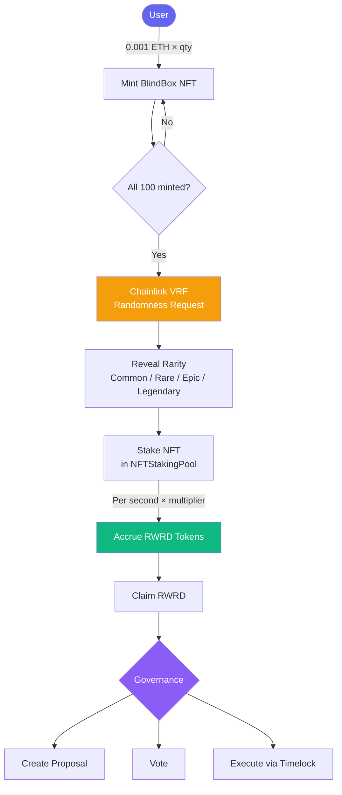
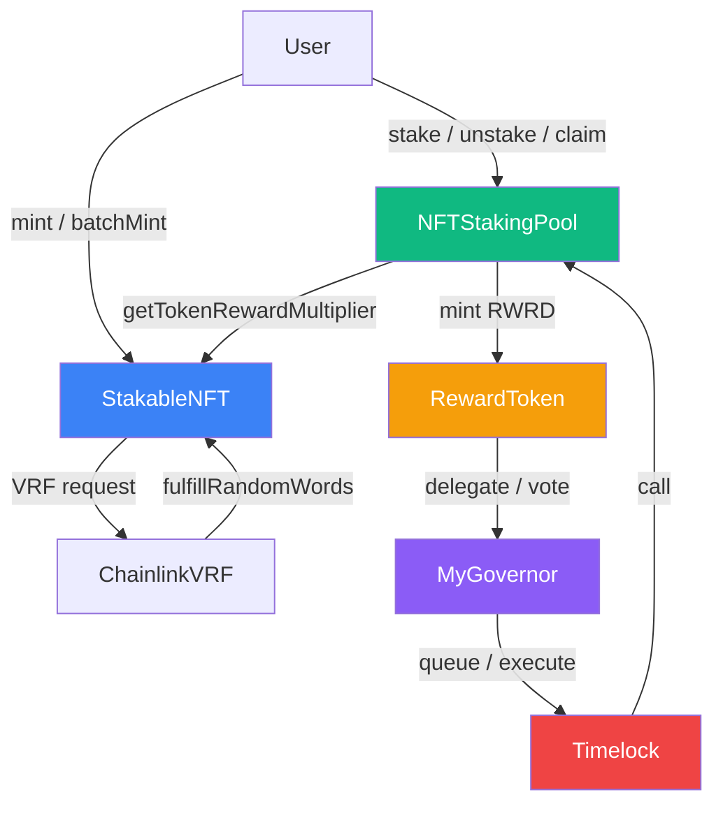

# BlindBox NFT Staking & DAO

A full-stack Web3 dApp featuring blind-box NFT minting, NFT staking with rarity-weighted rewards, and on-chain DAO governance — built on Scaffold-ETH 2.

**Live Demo → [https://blindbox-nft.snome.xyz](https://blindbox-nft.snome.xyz)**

---

## Overview

Users mint blind-box NFTs (rarity hidden at mint), reveal rarity via Chainlink VRF, stake NFTs to earn `RWRD` governance tokens, and use those tokens to vote on protocol proposals through a fully on-chain Governor + Timelock DAO.



---

## Feature Modules

### Mint
- Batch mint up to **20 NFTs** per wallet, **0.001 ETH** each
- Total supply: **100 NFTs**
- Rarity is hidden at mint — NFT appears as a blind box

### Reveal
- After the full collection is minted, the contract owner triggers a **Chainlink VRF** request
- A single random seed + shuffle offset assigns rarity to each token deterministically
- Rarity distribution: **Common 50 / Rare 30 / Epic 15 / Legendary 5**

### Stake
- Stake any revealed NFT into `NFTStakingPool`
- NFT is held in custody by the pool contract
- Reward accrues per second based on rarity multiplier

| Rarity | Multiplier | RWRD / day |
|---|---|---|
| Common | 1× | 1 RWRD |
| Rare | 1.5× | 1.5 RWRD |
| Epic | 2× | 2 RWRD |
| Legendary | 3× | 3 RWRD |

### Claim
- Claim accumulated `RWRD` at any time without unstaking
- Unstake returns the NFT and auto-claims pending rewards

### Governance (DAO)
- `RWRD` token implements `ERC20Votes` — staked rewards become voting power
- Create proposals, vote (For / Against / Abstain), execute through `Timelock`
- Parameters: 4% quorum, 1-block voting delay, 50-block voting period
- All protocol parameter changes (reward rate, pause, etc.) go through the Governor

### Ponder Indexer
- Real-time indexing of Stake / Unstake / Claim / Mint / Reveal events
- GraphQL API at `http://localhost:42069` (dev) or `NEXT_PUBLIC_PONDER_URL` (prod)
- `/stats` page queries aggregated staking data via `@tanstack/react-query`

---

## Contract Architecture



### Contract Descriptions

| Contract | Standard | Description |
|---|---|---|
| `StakableNFT` | ERC-721 | Blind-box NFT with Chainlink VRF reveal, rarity-based reward multipliers, role-based access (Admin / Operator / Pauser), IPFS metadata |
| `RewardToken` | ERC-20 + ERC20Votes | Governance token minted only by `NFTStakingPool`; supports ERC-2612 Permit for gasless approvals |
| `NFTStakingPool` | — | Staking pool; calculates time × multiplier rewards, mints RWRD, supports pause/unpause |
| `MyGovernor` | Governor + TimelockControl | On-chain DAO; 4% quorum, 50-block voting window |
| `Timelock` | TimelockController | Enforces delay on governance-approved execution |

---

## Deployed Contracts (Sepolia)

| Contract | Address |
|---|---|
| `StakableNFT` | [`0xFD39Cf65d3f8d2A920ED7E576b9022c820C19269`](https://sepolia.etherscan.io/address/0xFD39Cf65d3f8d2A920ED7E576b9022c820C19269) |
| `RewardToken` | [`0x4A42d30B419a86Ec3e1806C18665f9c4483F75D8`](https://sepolia.etherscan.io/address/0x4A42d30B419a86Ec3e1806C18665f9c4483F75D8) |
| `NFTStakingPool` | [`0xC498064677650C0E9d1dbfD9B73Ed553FB1cC1a0`](https://sepolia.etherscan.io/address/0xC498064677650C0E9d1dbfD9B73Ed553FB1cC1a0) |
| `MyGovernor` | [`0xd28990d7a5e83C38fCAcEC3eE1da5f81AD53B7EB`](https://sepolia.etherscan.io/address/0xd28990d7a5e83C38fCAcEC3eE1da5f81AD53B7EB) |
| `Timelock` | [`0xE321edF1d55AE9D2aB41872b88487CD19f32A2e1`](https://sepolia.etherscan.io/address/0xE321edF1d55AE9D2aB41872b88487CD19f32A2e1) |

> Network: **Ethereum Sepolia** (chain ID 11155111)

---

## Tech Stack

| Layer | Technology |
|---|---|
| Smart Contracts | Solidity 0.8.20, OpenZeppelin v5, Chainlink VRF v2.5 |
| Dev / Test | Hardhat, hardhat-deploy, hardhat-gas-reporter, Chai |
| Frontend | Next.js 15 (App Router), TypeScript, Tailwind CSS |
| Web3 | Wagmi v2, Viem, RainbowKit |
| Scaffold | Scaffold-ETH 2 (SE-2 hooks & components) |
| Indexer | Ponder, GraphQL, TanStack Query |
| Storage | IPFS (NFT metadata & images) |
| Package Manager | Yarn workspaces v3 |

---

## Local Development

### Prerequisites

- Node.js >= 20.18.3
- Yarn v3
- Git

### 1 — Install dependencies

```bash
yarn install
```

### 2 — Start a local chain

```bash
yarn chain
```

### 3 — Deploy contracts

```bash
yarn deploy
```

### 4 — Start the frontend

```bash
yarn start
# http://localhost:3000
```

### 5 — Start the Ponder indexer (optional)

```bash
yarn ponder:dev
# GraphQL playground: http://localhost:42069
```

### Environment Variables

Create `packages/nextjs/.env.local`:

```env
NEXT_PUBLIC_ALCHEMY_API_KEY=your_alchemy_key
NEXT_PUBLIC_WALLET_CONNECT_PROJECT_ID=your_wc_project_id
NEXT_PUBLIC_PONDER_URL=https://your-ponder-deployment.com   # production only
```

Create `packages/ponder/.env.local`:

```env
PONDER_RPC_URL_11155111=https://eth-sepolia.g.alchemy.com/v2/your_key
```

---

## Project Structure

```
packages/
├── hardhat/
│   ├── contracts/          # Solidity contracts
│   ├── deploy/             # hardhat-deploy scripts
│   └── test/               # Contract tests
├── nextjs/
│   ├── app/                # Next.js App Router pages
│   │   ├── mint/           # Blind-box minting UI
│   │   ├── my-nfts/        # NFT collection & rarity display
│   │   ├── stake/          # Stake / unstake / claim
│   │   ├── governance/     # DAO proposals & voting
│   │   ├── admin/          # Operator / Pauser admin panel
│   │   └── stats/          # Protocol statistics (Ponder data)
│   ├── components/         # Scaffold-ETH reusable components
│   ├── hooks/              # useScaffoldReadContract / WriteContract / EventHistory
│   └── contracts/          # Auto-generated ABI + address files
└── ponder/
    ├── ponder.config.ts    # Auto-synced from scaffold.config.ts
    ├── ponder.schema.ts    # onchainTable schema definitions
    └── src/                # Event indexing handlers
```

---

## Useful Commands

```bash
# Contracts
yarn hardhat:compile
yarn hardhat:test
yarn hardhat:verify --network sepolia

# Frontend
yarn next:build
yarn next:check-types
yarn next:lint

# Ponder
yarn ponder:codegen        # generate types from schema
yarn ponder:typecheck
```

---

## Deployment

### Frontend → Vercel

```bash
yarn vercel
```

Set env vars `NEXT_PUBLIC_ALCHEMY_API_KEY`, `NEXT_PUBLIC_WALLET_CONNECT_PROJECT_ID`, and `NEXT_PUBLIC_PONDER_URL` in the Vercel dashboard.

### Ponder Indexer

Deploy to any Node-compatible host. Set the start command to:

```bash
yarn ponder:start
```

Then set `NEXT_PUBLIC_PONDER_URL` in the frontend to point to the deployed indexer.
