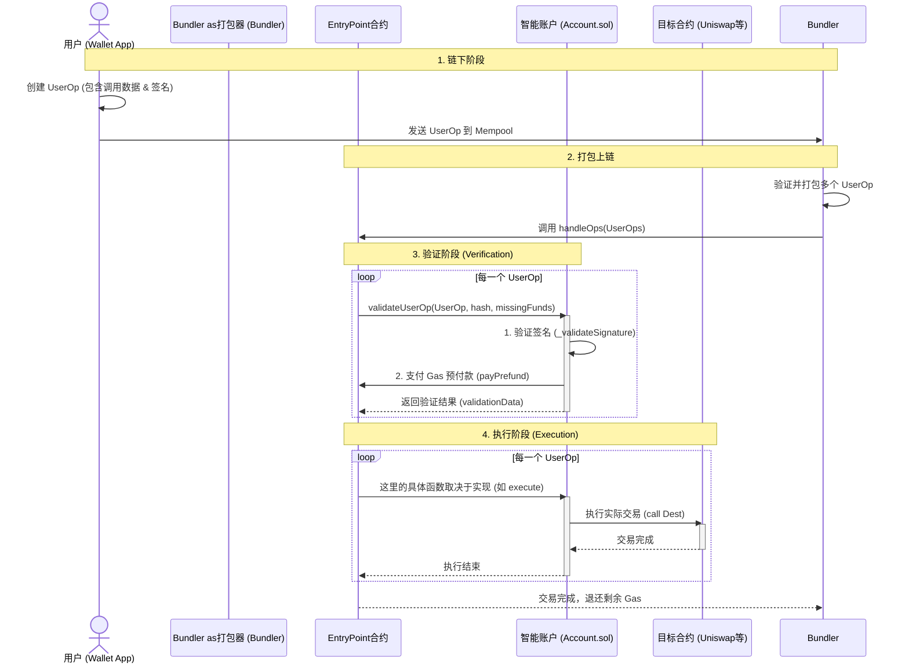

# 账户抽象 (Account Abstraction) 深度指南

## 1. 什么是账户抽象 (AA)?

在以太坊中，账户主要分为两种：
1.  **外部拥有账户 (EOA)**：也就是我们常用的 MetaMask 钱包。由私钥控制，逻辑固定（只能发起交易，验证签名）。
2.  **合约账户 (CA)**：由代码控制，可以有复杂的逻辑，但不能主动发起交易。

**账户抽象 (Account Abstraction, AA)** 的核心理念是：**将账户变成智能合约**。
这意味着你的钱包不再是不变的“私钥=账户”，而是一个**可编程的智能合约**。它把交易的**验证**（验证你是谁）和**执行**（你要做什么）逻辑从底层协议中剥离出来，由合约代码自己定义。

目前最主流的 AA 标准是 **ERC-4337**，它在不修改以太坊共识层的前提下实现了账户抽象。

---

## 2. 抽象账户 (Smart Account) vs 普通 EOA

| 特性 | 普通 EOA (MetaMask) | 抽象账户 (AA Wallet) |
| :--- | :--- | :--- |
| **控制权** | **私钥就是一切**。私钥丢了=资产没了。 | **可编程控制**。支持多签、社交恢复、Web2 登录等。 |
| **Gas 支付** | 必需用 ETH 支付 Gas。 | **灵活支付**。可以用 ERC20 代币支付，或者由项目方代付（Gasless）。 |
| **安全性** | 只有单因素认证（私钥签名）。 | **多因素认证 (2FA)**、每日限额、黑白名单等。 |
| **交易体验** | 每次操作需单独签名、单独上链。 | **批量交易 (Batching)**。一次签名完成 Approval + Swap。 |
| **可升级性** | 不可升级。 | **可升级**。可以像手机 App 一样更新钱包逻辑。 |
| **密钥轮换** | 无法更换私钥（只能换新钱包）。 | **可更换密钥**。不仅不用换地址，还可以随时撤销旧密钥。 |

---

## 3. ERC-4337 核心组件与角色

为了实现 AA，ERC-4337 引入了几个关键角色：

1.  **UserOperation (UserOp)**：
    这不是普通的 Transaction，而是一个类似于交易的数据结构，包含了“我想做什么”的所有信息（调用数据、Gas 限制、签名等）。
2.  **Bundler (打包器)**：
    一个特殊的节点（链下角色）。它负责收集用户的 UserOp，把它们打包成一笔真正的以太坊交易，发送到链上。
3.  **EntryPoint (入口点合约)**：
    **这是系统的大脑**。一个全局的单例合约（所有 AA 钱包共用一个）。它负责验证 UserOp 的合法性，并协调执行。
4.  **Smart Account (智能账户)**：
    **这是你的钱包**。它是一个智能合约（比如 `Account.sol` 的实现）。它必须包含验证逻辑（`validateUserOp`），告诉 EntryPoint：“是的，这个操作是我授权的”。
5.  **Paymaster (代付合约)** (可选)：
    负责替用户支付 Gas 费的合约。
6.  **Aggregator (聚合器)** (可选)：
    用于聚合签名，节省 Gas。

---

## 4. 使用流程逻辑 (ERC-4337 Workflow)

想象你发起一笔转账：

1.  **创建 UserOp**：
    你的钱包应用（前端）创建一个 `UserOperation` 对象。这包含了你想调用的函数、参数和你对这个操作的签名。
2.  **发送给 Bundler**：
    你把这个 UserOp 发送给 Bundler 网络（而不是直接发给以太坊节点）。
3.  **打包与提交**：
    Bundler 验证你的 UserOp 合法后，将其与其他人的 UserOp 打包在一起，作为一笔普通交易发送给 **EntryPoint** 合约。
4.  **EntryPoint 验证 (Validation Phase)**：
    EntryPoint 调用你的 **Smart Account** 的 `validateUserOp` 函数。
    *   你的合约检查签名是否正确。
    *   你的合约承诺支付 Gas 费（或者由 Paymaster 承诺）。
5.  **EntryPoint 执行 (Execution Phase)**：
    验证通过后，EntryPoint 再次调用你的 **Smart Account**。
    *   这一次是执行真正的操作（比如 `transfer` 或 `swap`）。
    *   如果在执行阶段失败了，Gas 费依然会被扣除，且 EntryPoint 状态不会回滚（为了防止 DoS 攻击）。

### 4.1 深入理解 EntryPoint：谁部署的？为什么要它？

这是一个非常关键的问题。

**1. 谁部署和维护？**
*   **单例合约 (Singleton)**：EntryPoint 在所有 EVM 兼容链上通常都部署在**完全相同的地址**（例如 `0x0000000071727De22E5E9d8BAf0edAc6f37da032`）。
*   **部署者**：它是由以太坊基金会的 ERC-4337 核心团队开发并部署的。
*   **维护**：它是一个**不可变 (Immutable)** 的智能合约（或者通过特定的 DAO 升级，但通常是部署新版本 V0.7, V0.8 等）。**没有人控制它**。一旦部署，它就是公共基础设施，像 Uniswap 协议一样运行。你不需要信任部署者，只需要信任代码（代码经过了最严格的审计）。

**2. 为什么要搞这么一个“中间人”？**
可以在每个人的钱包里写逻辑吗？理论上可以，但 EntryPoint 解决了一个巨大的难题：**去中心化打包的安全性与复杂性**。

*   **保护 Bundler (Bundler Safety)**：
    Bundler 在链下运行，它要打包陌生人的 UserOp。如果你的钱包代码很恶毒，在验证阶段（validateUserOp）故意消耗巨量 Gas 然后回滚，Bundler 就会亏钱。
    EntryPoint 包含极其复杂的规则（限制 Opcode、限制存储访问），**强制**你的钱包在验证阶段“老实守规矩”。如果没有 EntryPoint 统一执行这些检查，Bundler 根本不敢打包陌生人的交易。
*   **极简钱包开发**：
    校验签名、计算 Gas 退款、防止重放攻击、聚合签名……这些逻辑极难写对且极易出 Bug。EntryPoint 把这些**通用的、困难的脏活累活**全部揽下来了。
    你的 `Account.sol` 只需要关心：“这签名对不对？”剩下的安全屏障全由 EntryPoint    *   **统筹全局**：
    它使得 Paymaster（代付）、Aggregator（签名聚合）等高级功能可以跨钱包通用。

### 4.2 深入理解 Bundler：谁在跑？怎么赚钱？为什么怕陌生人？

**1. 谁运行 Bundler？它是节点吗？**
这是一个容易混淆的概念。
*   **它不是共识节点**：Bundler **不负责**打包区块（Block），也不参与 PoS 共识。它不取代 Geth 或 Reth。
*   **它是“节点伴侣” (Node Sidecar)**：Bundler 通常作为一个独立的服务运行，需要连接到一个标准的以太坊节点（RPC）来工作。
*   **可以理解为“UserOp 的中继站”**：
    *   普通的以太坊节点维护的是“普通交易池” (Tx Mempool)。
    *   Bundler 维护的是一个**独立的“UserOp 池” (UserOp Mempool)**。
    *   多个 Bundler 之间会互相传递 UserOp，形成一个**专用的 P2P 网络**。
    *   一旦 Bundler 决定打包，它会把这些 UserOp 拼成一笔普通的以太坊交易，发给普通节点去上链。

**2. Bundler 靠什么赚钱？**
Bundler 有明确的盈利模式：
*   **Gas 差价**：你在 UserOp 里设定了 `maxFeePerGas` (比如 50 gwei)，而当前链上实际 Gas 是 40 gwei。Bundler 以 40 gwei 上链，你付给它 50 gwei，中间的差价归它。
*   **MEV (最大可提取价值)**：Bundler 可以像矿工一样，通过重新排序 UserOp 来捕获套利机会。

**3. 为什么没有 EntryPoint 它就不敢打包？(核心安全问题)**
这就是著名的 **DoS 攻击向量**。

想象一下没有 EntryPoint 规则的场景：
1.  **黑客构造一个恶意 UserOp**：这笔交易在 Bundler **链下模拟**（Simulation）时显示“验证通过，我会付给你 1 ETH 手续费”。
2.  **埋雷**：黑客的代码里写着 `if (block.timestamp % 2 == 0) revert();`。
3.  **上链失败**：Bundler 信以为真，把你这个 UserOp 打包上链。结果区块时间变了，你的交易在链上 Revert（回滚）了。
4.  **Bundler 亏惨了**：因为以太坊规则是“即使 Revert 也要收 Gas”，Bundler 必须为这笔失败的交易向矿工支付真金白银的 ETH。但因为你的交易回滚了，你承诺给 Bundler 的 1 ETH 手续费**并没有转账成功**。
5.  **结局**：黑客可以构造几万个这种交易，瞬间把 Bundler 的钱耗光。

**EntryPoint 的解决方案：**
EntryPoint 和 ERC-4337 标准规定了极其严格的 **验证规则 (Validation Rules)**：
*   在 `validateUserOp` 阶段，**禁止访问 block.timestamp**、**禁止访问其他合约的存储**等等。
*   这保证了：**只要在链下模拟成功，它在链上就一定能验证通过并扣款**。
*   这样 Bundler 才能放心地先垫付 Gas，因为它知道它一定能收回这笔钱。

### 4.3 核心疑问：为什么必须分两步走？(Validate -> Execute)

你问到了 AA 设计中最精妙的地方。为什么不验证通过后直接执行？为什么要 EntryPoint 调用两次？

**原因 1：为了保护 Bundler 的钱包 (核心原因)**
如果把验证（Validate）和执行（Execute）写在同一个函数里，比如 `doEverything()`：
*   **场景**：你写了一个 `doEverything` 函数，前 10 行验证签名并支付 Gas，第 11 行去 Uniswap 交易。
*   **攻击**：你在第 11 行写个逻辑 `if (gasPrice > 100) revert();`。
*   **结果**：Bundler 模拟时一切正常。但上链时，如果 Gas 价格波动，触发了第 11 行的 revert。
*   **灾难**：在以太坊中，**一旦 Revert，前面支付 Gas 的操作也会回滚**！这意味着 Bundler 帮你在链上执行了代码，付了矿工费，但你之前承诺付给 Bundler 的钱（在前 10 行）因为回滚而取消了。Bundler 被“白嫖”了。

**解决方案：两阶段隔离 (Sandbox)**
*   **阶段一 (Validate)**：必须在一个**受限环境**中运行。
    *   不能访问时间戳、不能访问其他合约存储。
    *   **最重要的是**：EntryPoint 调用 `validateUserOp` 时，会捕获它的成功状态。**一旦这一步成功，EntryPoint 就会强制扣除 Gas 费**。
*   **阶段二 (Execute)**：在一个**开放环境**中运行。
    *   这时候随便你做什么操作。
    *   **关键点**：即使执行阶段 Revert 了，**仅仅是执行阶段回滚**，第一阶段扣除的 Gas 费**不会回滚**。Bundler 依然能收到钱。

**EntryPiont 实际上是这么做的（伪代码）：**
```solidity
try account.validateUserOp() {
    // 1. 验证成功，先强制扣钱 (Checkpoint)
    payGas(bundler); 
} catch {
    // 验证都不过，直接丢弃，Bundler 不会上链
    revert(); 
}

// 2. 然后再执行，这时候死活都不影响 Bundler 收钱了
try account.execute() {
    // 执行成功
} catch {
    // 执行失败，但 Gas 费不退
}
```

**原因 2：为了批量处理 (Batching)**
EntryPoint 的 `handleOps` 可以一次处理 10 个用户的 UserOp。
*   它先**一口气验证完**这 10 个用户（确保 10 份 Gas 费都到账）。
*   然后再**一个个执行**这 10 个操作。
*   如果混在一起，用户 A 的执行可能会修改某些状态，导致用户 B 的验证突然失效（Front-running），这会增加复杂性。

*   如果混在一起，用户 A 的执行可能会修改某些状态，导致用户 B 的验证突然失效（Front-running），这会增加复杂性。

### 4.4 可是...如果 validateUserOp 在链上失败了，Bundler 不是照样亏钱吗？

确实，如果 UserOp 真的被打包上链了，结果 `validateUserOp` 返回了失败（或者 Revert），Bundler 确实需要支付矿工费，且拿不到用户的任何退款。

**但是（这是重点）：这种情况几乎不会发生。**

靠什么保证呢？**链下模拟 (Off-chain Simulation) + 禁忌规则**。

1.  **先模拟，后打包**：
    Bundler 在收到你的 UserOp 后，**绝不会**直接扔到链上。
    它会先在本地运行一个“模拟器”，跑一遍 `validateUserOp`。
    *   如果本地模拟挂了 -> 直接丢弃，不拉黑，不打包。Bundler 成本为 0（只费点电）。
    *   如果本地模拟过了 -> 准备打包。

2.  **禁忌规则 (Storage Rules) 保证“模拟结果 = 上链结果”**：
    你可能会问：“模拟的时候过了，但上链的那一瞬间（过了几秒钟），状态变了怎么办？”
    
    ERC-4337 规定了死板的**验证规则**（EIP-7562）：
    *   在 `validateUserOp` 期间，你**只允许访问你自己的 Storage**。
    *   **禁止**访问 `block.timestamp`、`block.number`（因为这些上链时肯定会变）。
    *   **禁止**读取其他合约的状态（因为别人可能在那几秒钟内改了状态）。
    
    **结论**：因为你不能依赖任何“会变的东西”，所以：
    **只要你现在的模拟通过了，几秒钟后上链时，它 100% 也会通过。**
    
    Bundler 只有在模拟通过，且确认你遵守了这些“禁忌规则”后，才会把你打包上链。

### 4.5 Gas 费是分两次收的吗？(Prefund 机制)

你问的很细致！但不完全是“收两次”，准确的说是 **“先抵押最大值，再退还剩余值” (Prefund & Refund)**。

**整个扣费流程如下：**

1.  **计算最大开销**：
    Bundler 提交 UserOp 时，上面写了 `callGasLimit` (执行预算) + `verificationGasLimit` (验证预算)。
    假设这些加起来，**最大可能**要消耗 0.1 ETH。
2.  **第一步：验证阶段 (Validation) -> 扣除 Prefund**
    当 `validateUserOp` 成功时，EntryPoint **立刻、强制**从你的账户余额中扣除这 0.1 ETH（最大值）。
    *   这就好比住酒店，入住时先刷 5000 块预授权（押金）。
    *   这笔钱暂时由 EntryPoint 保管。
3.  **第二步：执行阶段 (Execution) -> 实际消耗**
    EntryPoint 调用你的账户执行操作。
    实际只用了 0.02 ETH 的 Gas。
4.  **第三步：结束阶段 -> 退款 (Refund)**
    EntryPoint 发现：“哦，你只用了 0.02 ETH，但我扣了你 0.1 ETH。”
    于是，EntryPoint 会把剩余的 0.08 ETH **退还**到你的账户余额里。
    最后把那 0.02 ETH 给 Bundler 报销。

**总结：**
不是“收两次”，而是“**先扣一大笔押金，最后多退少补**”。这样保证了 Bundler 绝对不会亏（因为押金是按最大预算扣的）。

### 4.6 所以究竟是谁先付的钱？(Bundler 垫付)

您的理解非常准确！**这就是“中继”的核心逻辑。**

1.  **对于以太坊网络 (Miners/Validators)**：
    *   它们只认 `msg.sender`。
    *   Bundler 发起了这笔交易 (`handleOps`)，所以 **Bundler 的 EOA 钱包必须先支付所有的 Gas 费给矿工**。
    *   此时，Bundler 是**负债**状态（它自掏腰包垫付了 ETH）。

2.  **对于 EntryPoint 内部账本**：
    *   交易执行过程中，EntryPoint 扣除了**用户**的 ETH。
    *   在交易结束前，EntryPoint 会把扣下的这笔 ETH **直接转账给 Bundler**。
    *   此时，Bundler 获得了**报销**。

**资金流向链：**
`Bundler (垫付 ETH 给矿工)`  <--- `EntryPoint (从用户存款挪钱)` <--- `User Account (用户存的 ETH)`

这也是为什么 Bundler 必须有流动资金才能干活，也解释了为什么它必须严格验证——如果它垫付了钱给矿工，结果 EntryPoint 没能成功从用户那里扣到钱给它报销，它就亏损了。

### 4.7 怎么赚钱？(回扣/差价/小费)

当然有赚头！要是只报销不赚钱，谁会去跑 Bundler 呢？

**利润来源主要有两块：**

1.  **显性利润：优先费 (Priority Fee / Tip)**
    *   在 UserOp 中，有一个参数叫 `maxPriorityFeePerGas`（给矿工/Bundler 的小费）。
    *   这就好比你叫外卖，你要额外付 5 块钱配送费。这笔钱是直接给 Bundler 的。
    *   **公式**：`Bundler 收入 = Gas用量 * (用户愿意付的 PriorityFee)`

2.  **隐性利润：赚 Gas 差价 (Gas Spread)**
    *   **场景**：
        *   用户设置 `maxFeePerGas` = 100 Gwei（意思是：哪怕油费涨到 100，我也愿意付）。
        *   当前链上实际 `BaseFee` = 80 Gwei。
        *   Bundler 提交交易时，只需要付 80 Gwei 给网络。
    *   **操作**：
        *   EntryPoint 按照用户的意愿（100 Gwei 或略低）扣费。
        *   Bundler 实际只付了 80 Gwei。
        *   **差价 (Spread)**：每单位 Gas 赚了 20 Gwei（当然这取决于 EntryPoint 的具体计算公式，通过调整 `maxPriorityFee` 实际上 Bundler 可以捕获这部分剩余价值）。

**简单来说**：
用户付的钱 = `成本 (BaseFee)` + `Bundler利润 (PriorityFee)`。
Bundler 就像一个“Gas 倒爷”，低价买入区块空间，高价（含服务费）卖给用户。

### 4.8 灵魂拷问：到底谁是“抽象账户”？

回到您最初的问题：“抽象账户具体指的是谁？”

**答案：是的，就是 `Account.sol` (以及它的子类)。**

*   **学术上**：“账户抽象” (Account Abstraction) 指的是一种**技术体系**或**设计理念**（将验证逻辑从共识层抽离）。
*   **具体指代上**：当我们说“我有一个抽象账户”时，指的就是**部署在链上的那个智能合约**（Smart Account）。
    *   在代码里，它就是继承了 `Account.sol` 的那个合约。
    *   这个合约地址（如 `0x123...`）就是你的钱包地址。
    *   你的资产（ETH, NFT）全部存放在这个合约地址里，而不是你的私钥对应的地址里。

**一句话总结：也就是 `Account.sol` 这个合约，翻身做主人，替代了原本 MetaMask 里的那个私钥账户，成为了你在区块链世界的新身份证。**

### 4.9 我作为一个普通用户，怎么操作这个合约呢？

这确实是最大的误区。既然它是个合约，难道我要去 Etherscan 上点击 "Write Contract" 吗？

当然不是！你依然会使用一个漂亮的 App（钱包界面），但底层逻辑变了：

**1. 手里的“遥控器” (Signer/Key)**
虽然你的**账户**是链上的合约，但你依然需要一把**钥匙**来控制它。
*   这把钥匙可以是你的 MetaMask (EOA)。
*   也可以是你的手机指纹 (Passkey)。
*   **区别在于**：以前这把钥匙就是你的账户（丢了就完了）；现在这把钥匙只是一个**遥控器**（丢了可以换）。

**2. 这里的交互流程**
*   **在你眼里**：你打开了一个 AA 钱包 App（比如 Argent, UniPass, 或者内置了 AA 的游戏），点击了“转账”。App 弹出一个框让你签名（确认）。你签完名，操作就完成了。
*   **在后台**：
    1.  App 没有发交易给以太坊节点。
    2.  App 帮你把你的意图打包成了 `UserOp`。
    3.  App 拿着你的签名（遥控器信号）贴在 UserOp 上。
    4.  App 把这个 UserOp 发送给了 Bundler。

**所以，你依然需要一个“界面” (Client)**。
你不能直接用普通的 MetaMask 插件去控制 AA 账户（因为它只会发普通 Transaction），你需要使用**专门支持 AA 的钱包客户端**，或者 DApp 内置的 **嵌入式钱包 (Embedded Wallet)**。

### 4.10 它是怎么验证“我就是我”的？(Owner Storage)

是的，你的理解完全正确。

**1. Account 合约里存了什么？**
Account 合约的状态变量（State Variables）里，必须存储一个**“谁是主人”**的记录。
*   **最简单的单签模式**：合约里会有一个变量 `address public owner;`。在你由于部署这个合约的时候，这个 `owner` 会被初始化为你手里的那个 EOA 地址（或者 Passkey 的公钥）。
*   **多签模式**：合约里可能存了一个数组 `address[] public owners;`。

**2. validateUserOp 到底在验证什么？**
当 EntryPoint 调用 `validateUserOp(userOp, ...)` 时，你的合约代码会跑这几行逻辑（伪代码）：

```solidity
function validateUserOp(UserOp op, ...) external {
    // 1. 从 UserOp 里取出签名
    bytes memory signature = op.signature;
    
    // 2. 算出是谁签的名 (ecrecover)
    address signer = ECDSA.recover(opHash, signature);
    
    // 3. 关键：检查签名者是不是我存的那个 owner
    if (signer != this.owner) {
        revert("你不是号主！");
    }
    
    // 4. 只有对上了，才付钱给 EntryPoint
    payPrefund();
}
```

所以，**Account 合约就是你的“链上数字替身”**。它记住了你的样子（Owner 地址），别人拿着错误的签名来，它根本不认。

### 4.11 这里的 Passkey 是什么？(Web3 的杀手级应用)

这是一个非常前沿且重要的概念。

**1. 传统方式 (EOA)**
你的要是是一串 **64 位的十六进制私钥**。
*   你记不住它。
*   你得把它抄纸上藏保险箱。
*   每次签名要用插件钱包弹出个窗口。

**2. Passkey 方式 (WebAuthn / FIDO2)**
Passkey 是苹果、谷歌、微软联合推广的“无密码登录”标准。
*   **私钥在哪？** 它是生成并保存在你的 **设备安全芯片** (Secure Enclave) 里的。
*   **怎么调用？** 用你的 **生物识别** (FaceID / TouchID / 指纹)。
*   **公钥在哪？** 公钥被存到了你的 AA 智能合约里（作为 `owner`）。

**3. 结合 AA 的魔法**
*   当你想转账时，钱包 App 唤起系统的 FaceID。
*   你扫一下脸。
*   手机内部芯片用私钥对 `UserOp` 签名（使用的是 `secp256r1` 曲线，也就是 WebAuthn 标准曲线）。
*   **注意**：以太坊原生只支持 `k1` 曲线，不支持这种 `r1` 曲线。**普通 EOA 根本用不了 Passkey。**
*   **但是 AA 可以！** 你的 AA 合约可以通过编写特定的代码（验证器）来验证这种 FaceID 的签名。

**这意味着：用户根本不需要知道什么是私钥，只需要扫脸就能掌管资产。这是 Web3 走向十亿用户的关键技术。**

### 4.12 行业内主流的验证方式有哪些？

既然 `validateUserOp` 是由合约自己实现的，这就打开了无限的想象空间。目前行业内主流的验证逻辑有以下几种：

1.  **标准单签 (ECDSA - secp256k1)**
    *   **原理**：和普通 EOA 一样。
    *   **实现**：使用 Solidity 内置的 `ecrecover`。
    *   **场景**：大多数 AA 钱包的默认模式，为了兼容习惯。

2.  **链上多签 (On-chain Multisig)**
    *   **原理**：需要 M-of-N 个签名才能通过验证。
    *   **实现**：UserOp 的 `signature` 字段里打包了多个人的签名。`validateUserOp` 会循环验证每一个签名是否属于 Owner 列表。
    *   **场景**：Safe (Gnosis Safe) 钱包，企业资金管理，家庭金库。

3.  **Passkey (WebAuthn - secp256r1)**
    *   **原理**：验证手机/电脑安全芯片生成的签名。
    *   **实现**：由于以太坊没有内置 `r1` 曲线的预编译合约（RIP-7212 正在推进中），目前通常需要使用高度优化的 Solidity 库（如 FreshCryptoLib）来在链上计算，Gas 费会稍高一些。
    *   **场景**：小白用户钱包 (JoyID, Clave)，追求极致体验。

4.  **会话密钥 (Session Keys)**
    *   **原理**：我授权一个**临时私钥**，只允许它在**未来 1 小时内**，调用**GameA 合约**的**move() 函数**。
    *   **实现**：
        *   `validateUserOp` 检查签名者是不是这个临时私钥。
        *   **关键**：同时检查 `UserOp.callData`（你要调用的函数）和 `block.timestamp` 是否在授权范围内。
    *   **场景**：链游（全链游戏），不需要每次移动都弹窗签名；或者 AI 代理自动交易。

5.  **社交恢复 (Social Recovery)**
    *   **原理**：平时用主钥匙。如果主钥匙丢了，让 3 个朋友签名称为“守护者”，生成新的主钥匙。
    *   **实现**：验证逻辑中包含一个 `recover()` 模式，验证守护者的签名而非 Owner 的签名。
    *   **场景**：几乎所有成熟的 AA 钱包 (Argent, Loopring)。

### 4.13 深度揭秘：会话密钥 & 社交恢复怎么实现的？

你问到了 AA 最大的两个魔法。这两个功能彻底改变了用户体验。

#### 1. 会话密钥 (Session Keys)：为什么不用弹窗？

**核心原理：** 就像你去游乐场，你要先买票（主钥匙签名），然后拿到一张手环（会话密钥）。只要还在游乐场里，你出示手环就能玩项目，不需要每次都掏钱买票。

**具体流程：**

1.  **生成手环 (生成临时密钥)**：
    *   当你打开一个链游网页时，网页的 JavaScript 会在浏览器本地偷偷生成一对临时的公私钥（这就是 Session Key）。
    *   私钥保存在浏览器的 LocalStorage 里。
2.  **授权手环 (主钥匙签名)**：
    *   网页弹窗问你：“是否允许未来 1 小时内，自动帮我在游戏里打怪？”
    *   你用主钱包（MetaMask/Passkey）签**一次**名。
    *   这个操作会发送一个交易给你的 AA 合约，告诉它：“记录一下，`这个临时公钥` 是我的人，有效期 `1小时`，只允许调用 `GameContract.attack()`”。
3.  **自动玩游戏 (免弹窗)**：
    *   之后你在游戏里点“攻击”按钮。
    *   **网页在后台用那个临时私钥对 UserOp 进行签名。**
    *   因为私钥就在浏览器里，所以不需要弹窗问你（就像 App 读取本地缓存一样）。
4.  **合约验证 (validateUserOp)**：
    *   你的 AA 合约收到 UserOp。
    *   检查两件事：
        1.  签名者是不是被记录的那个临时公钥？
        2.  当前时间是不是在 1 小时内？调用的函数是不是 `attack()`？
    *   如果都对，验证通过，执行操作。

**结论**：不用弹窗是因为**真正的签名者（临时私钥）就在 App 手里**，它自己签了发出去，而你就在最开始授权了一下。

#### 2. 社交恢复 (Social Recovery)：朋友怎么救我？

**核心原理：** 你的 AA 合约里有一个“守护者名单”。

**代码逻辑 (伪代码)：**

```solidity
address public owner; // 你的新公钥
mapping(address => bool) public guardians; // 朋友们的公钥
uint256 constant THRESHOLD = 3; // 需要3个朋友

// 这是一个特殊的函数，或者写在 execute 逻辑里
function recoverOwner(address newOwner, bytes[] memory guardianSignatures) external {
    uint256 validSignatures = 0;
    
    // 循环检查每一个前面是否来自守护者
    for (uint i = 0; i < guardianSignatures.length; i++) {
        address signer = ECDSA.recover(..., guardianSignatures[i]);
        if (guardians[signer]) {
            validSignatures++;
        }
    }

    // 够数了就重置主人
    if (validSignatures >= THRESHOLD) {
        owner = newOwner;
    }
}
```

**流程：**
1.  你的手机丢了（私钥丢了）。
2.  你买个新手机，生成一个新公钥。
3.  你在钱包 App 上点“我要恢复”。App 生成一个特殊的请求。
4.  你把这个请求链接发微信给你的 5 个好朋友。
5.  朋友们点开链接，用他们的钱包签名确认（即使朋友用的是普通 EOA 也可以）。
6.  当凑齐 3 个签名后，Bundler 把这笔交易上链。
7.  你的 AA 合约验证通过，把 `owner` 修改为你新手机的公钥。
8.  **复活成功！** 你重新拿回了控制权。

### 4.14 终极疑问：为什么不能直接调用 Account？非要绕一大圈？

这是一个直击灵魂的问题。既然 Account 是个合约，我直接用 MetaMask 发一笔交易去调用 `Account.execute()` 不行吗？

**答案：行，但是这就失去了 AA 的意义，这就退化回了普通多签钱包。**

**核心矛盾：**
要“直接调用”智能合约，你必须满足两个条件：
1.  **你必须有 ETH**：因为发起交易的一瞬间，矿工就要扣 Gas。
2.  **你必须有 EOA 私钥**：因为以太坊底层只认 ECDSA 签名。

**如果你直接调用：**
*   **Gas 代付 (Gasless)**：**做不到**。因为你自己是 `msg.sender`，你必须付钱。
*   **Passkey / 手机签名**：**做不到**。因为你发起交易必须用 EOA 私钥签名，而不能用 FaceID 签名。
*   **隐私/社交登录**：**做不到**。

**AA (ERC-4337) 的本质：**
它是为了解决 **“我没有 ETH，我也没有 EOA 私钥，但我依然想操作合约”** 这个悖论。

*   **Bundler 的作用**：它是一个**有 ETH、有 EOA** 的雷锋。它替你发交易，替你付 Gas。
*   **EntryPoint 的作用**：它保证了这个“雷锋”能从你的合约里拿到报销，不被白嫖。

所以，这套复杂的机制，就是为了**打破“必须持有 ETH 才能操作链”的枷锁**。

### 4.15 既然是“报销”，那能不用 ETH 报销吗？(Paymaster 自定义代币支付)

这又是一个极好的问题！

**1. EntryPoint 只认 ETH (Native Token)**
EntryPoint 非常死板。它在给 Bundler 报销时，**只使用 ETH**。它不支持直接扣用户的 USDC。
所以，如果你的 Account 只有 USDC 而没有 ETH，EntryPoint 这一步会失败。

**2. 那怎么实现“用 USDC 付 Gas”呢？**
这就引入了最后一个关键角色：**Paymaster (代付人/汇率兑换商)**。

**流程变成了这样：**
1.  你告诉 Paymaster：“嘿，我给你 10 USDC，你帮我付那 0.005 ETH 的 Gas 给 EntryPoint 呗？”
2.  Paymaster 说：“成交。”
3.  **上链过程**：
    *   **EntryPoint 问**：这次谁付钱？
    *   **Paymaster 答**：我付！
    *   **EntryPoint**：从 Paymaster 在我这里的押金里扣除 0.005 ETH 给 Bundler。
    *   **Paymaster 内部逻辑**：调用你的 Account，把你的 10 USDC 转走。

**总结：**
*   **链的底层**：永远只烧 ETH。
*   **中间层 (EntryPoint)**：只处理 ETH 转账。
*   **应用层 (Paymaster)**：负责“收你的 USDC，付它的 ETH”，充当了**去中心化换汇商**的角色。

### 6. 历史、现状与未来

**1. 历史回顾**
*   **早期 (2015-2020)**：V神很早就想做 AA，提过 EIP-86, EIP-2938。但那时候方案都要**修改以太坊共识层**（硬分叉），难度太大，一直没推下去。
*   **转折点 (2021)**：V神和核心开发者提出了 **ERC-4337**。最大的创新是**完全不改共识层**，纯靠智能合约和链下 Bundler 实现了 AA。
*   **里程碑 (2023.3)**：ERC-4337 核心合约 (EntryPoint v0.6) 正式部署到以太坊主网，标志着 AA 时代的正式开启。

**2. 目前发展现状**
*   **普及度**：处于**早期爆发阶段**，但尚未完全取代 EOA。
*   **Layer 2 是主力军**：由于 AA 的 Gas 费比普通 EOA 略高（因为要跑合约逻辑），所以在主网用不起。但在 Startnet, zkSync (原生 AA), Base, Optimism 等 L2 上，AA 正在快速普及。
*   **基建成熟**：Bundler 服务商（Stackup, Pimlico）和 Paymaster 服务已非常成熟，接入很简单。

**3. 未来展望 (EIP-7702)**
*   目前最大的痛点是：**老用户不想换钱包**。大家手里都有 MetaMask 的 EOA 地址，资产都在里面，不想迁移到新的 AA 合约地址去。
*   **EIP-7702 (2024)**：这是 V 神最新的提案。允许**给现有的 EOA 账户“临时贴上”合约逻辑**。这意味着未来你的 MetaMask 地址也可以直接拥有 AA 的功能（如批量交易、代付），而不需要把资产转移到新地址。这被认为是 AA 彻底普及的终局方案。

---
**感谢阅读！** 这篇指南涵盖了账户抽象从底层原理到应用实现的方方面面。如果您还有任何细节疑问，欢迎继续提问。



---

## 5. 使用场景 (Use Cases)

1.  **社交恢复 (Social Recovery)**：
    忘记私钥不再是末日。可以通过指定的 3 个好友、或者邮箱/手机号来恢复账户控制权。
2.  **Gas 代付 (Sponsored Transactions)**：
    新用户不需要去买 ETH 就能使用 DApp。项目方可以补贴 Gas，或者允许用户用 USDC 支付 Gas。
3.  **批量交易 (Batch Transactions)**：
    玩区块链游戏或 DeFi 时，不再需要先 Approve 再 Swap，两步合并为一步，一次签名即可。
4.  **会话密钥 (Session Keys)**：
    在一段时间内（比如玩游戏的一小时内），允许自动签名小额交易，不需要每次弹窗确认。
5.  **量子抗性签名**：
    未来可以升级钱包支持更安全的签名算法（如 BLS, Quantum-safe 算法），而不需要更换地址。

---

## 6. OpenZeppelin `Account.sol` 的关系

你在 `packages/hardhat/node_modules/@openzeppelin/contracts/account/Account.sol` 看到的代码，是 OpenZeppelin 提供的 **ERC-4337 智能账户基类**。

**它是做什么的？**
它帮你处理了最复杂、最容易出错的底层逻辑：
*   **遵守标准**：它实现了 `IAccount` 接口，保证能被 EntryPoint 正确调用。
*   **权限检查**：它包含 `onlyEntryPoint` 修饰符，防止黑客绕过 EntryPoint 直接攻击你的钱包。
*   **预付款逻辑**：它处理了向 EntryPoint 支付 Gas `prefund` 的逻辑。

**如果你要开发一个 AA 钱包，你需要做的是：**
1.  继承 `Account` 合约。
2.  **实现 `_rawSignatureValidation`**：定义你自己的鉴权逻辑（是用 ECDSA 私钥？还是用指纹 Passkey？还是多签？）。
3.  **实现执行逻辑**：`Account.sol` 默认不包含执行任意代码的功能（为了安全）。你需要添加函数来接收 EntryPoint 的调用并去执行 `call`（比如调用 Uniswap）。

**总结：** `Account.sol` 是骨架，你需要填入灵魂（验证逻辑）和肌肉（执行能力）。
