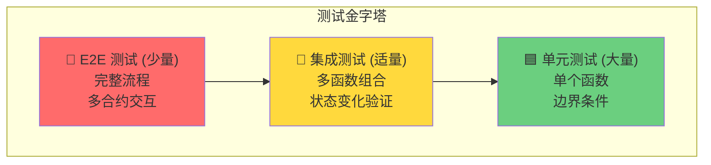
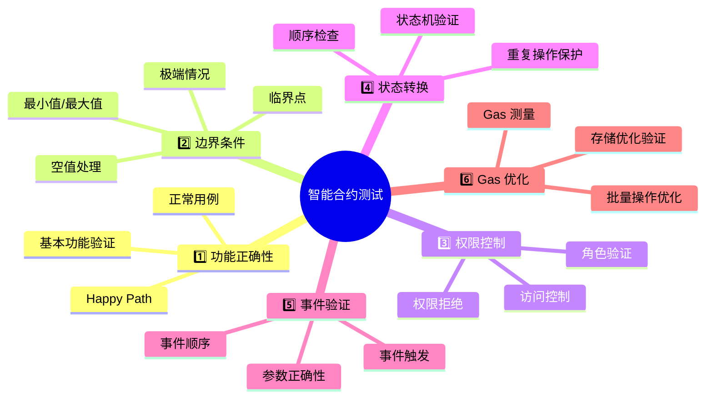
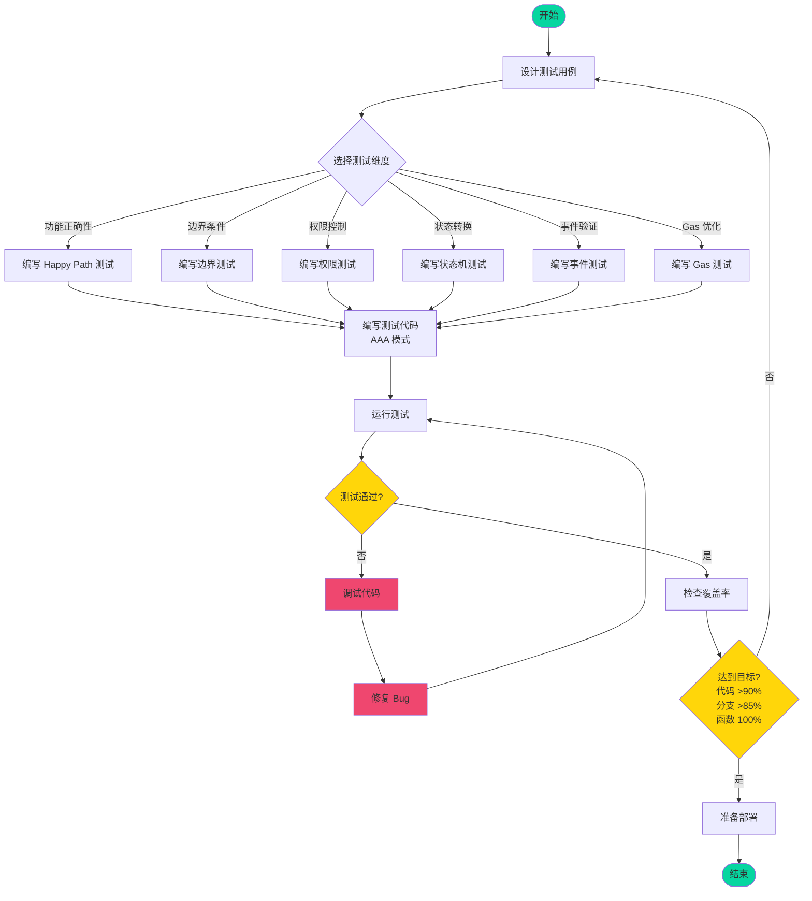
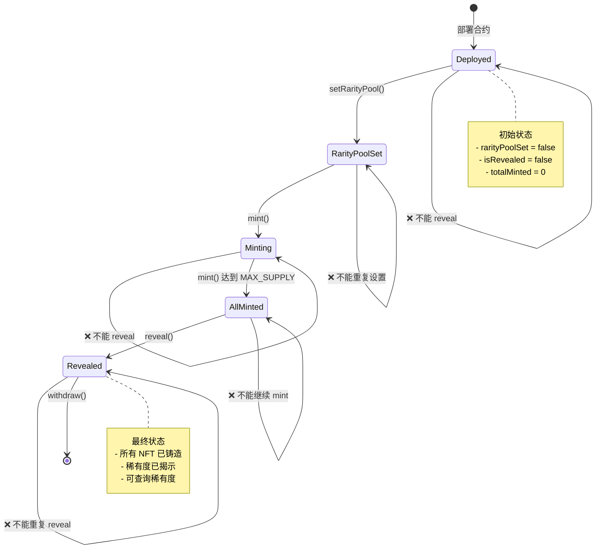
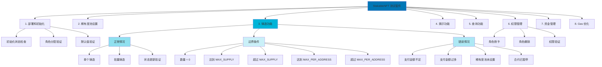
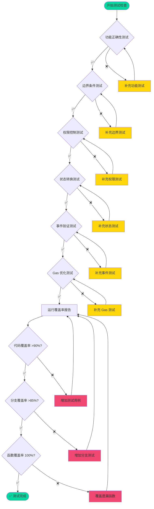
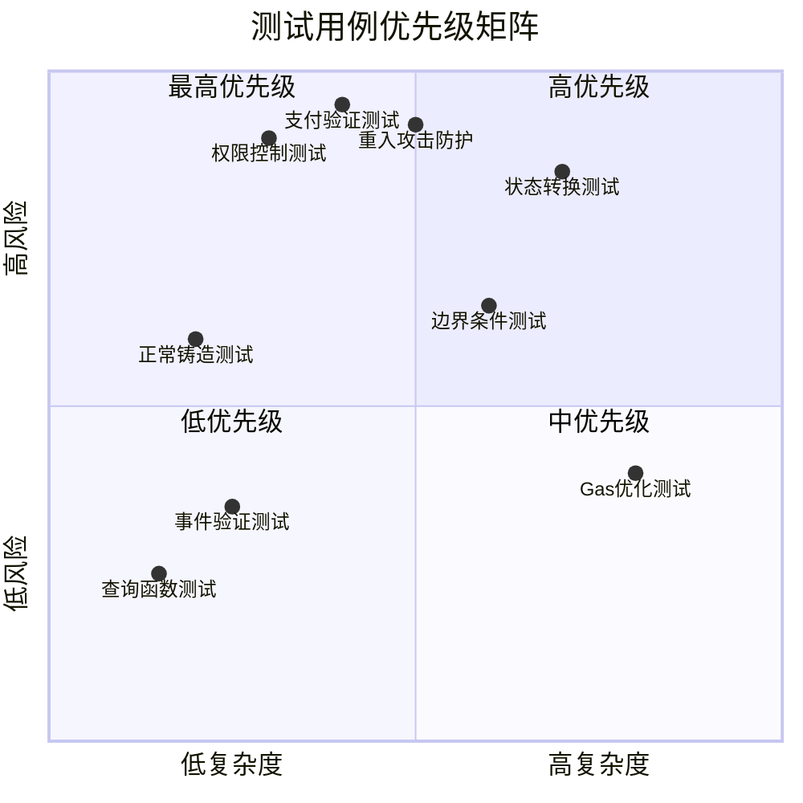
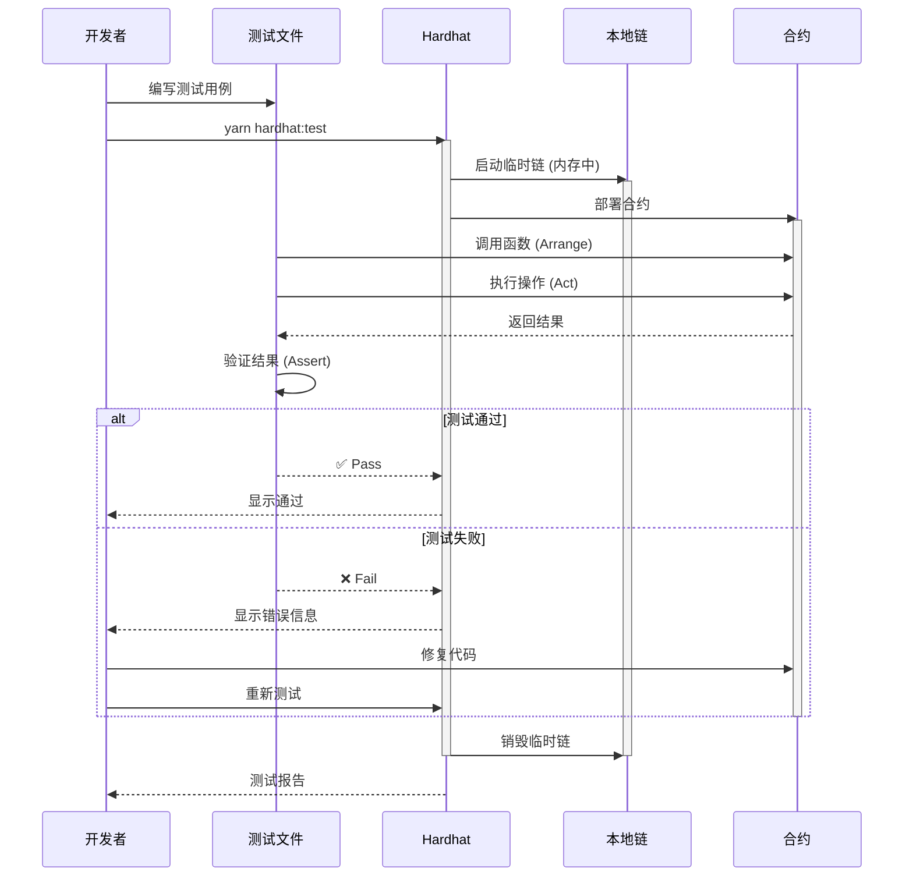
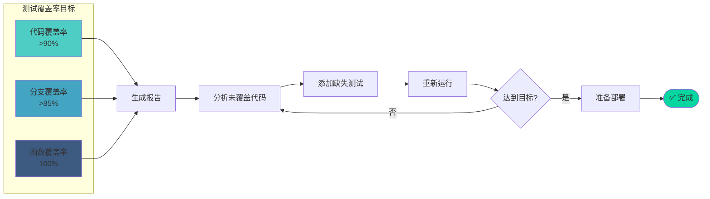

# 智能合约测试方法论

## 1. 测试金字塔

## 2. 测试设计六维度

## 3. AAA 测试模式流程

```mermaid
flowchart LR
    A[Arrange<br/>准备环境] --> B[Act<br/>执行操作]
    B --> C[Assert<br/>验证结果]

    A1[部署合约] --> A
    A2[设置初始状态] --> A
    A3[准备测试账户] --> A

    B --> B1[调用合约函数]
    B --> B2[发送交易]

    C --> C1[检查返回值]
    C --> C2[验证状态变化]
    C --> C3[确认事件触发]

    style A fill:#a8dadc
    style B fill:#457b9d
    style C fill:#1d3557
```

## 4. 完整测试流程

## 5. 状态机测试示例

## 6. 测试用例组织结构

## 7. 测试检查清单

## 8. 测试优先级矩阵

## 9. 实际测试执行流程

## 10. 测试覆盖率追踪

---

## 使用说明

1. **测试金字塔**: 指导测试类型的分布比例
2. **六维度**: 全面覆盖测试场景
3. **AAA 模式**: 标准化测试结构
4. **完整流程**: 从设计到部署的完整路径
5. **状态机**: 验证合约状态转换的正确性
6. **组织结构**: 清晰的测试文件组织
7. **检查清单**: 确保测试完整性
8. **优先级矩阵**: 合理安排测试顺序
9. **执行流程**: 理解测试运行机制
10. **覆盖率追踪**: 保证测试质量

保存此文件后,可以在任何支持 Mermaid 的工具中查看图表(如 VS Code + Mermaid 插件、GitHub、Notion 等)。
