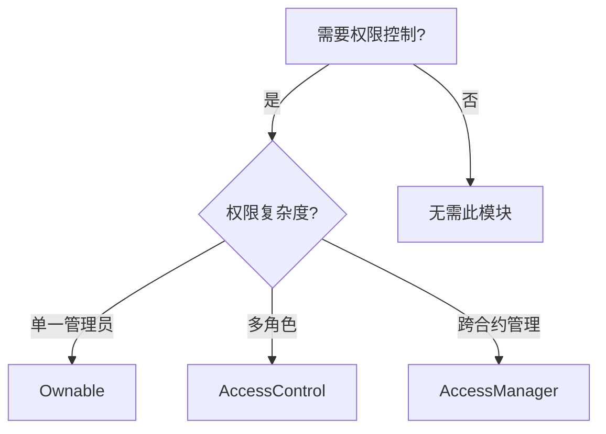
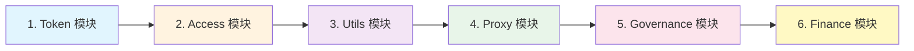

# OpenZeppelin Contracts 架构与功能模块详解

> 本文档详细介绍了 OpenZeppelin Contracts 库的目录结构、核心模块及各文件的作用,帮助开发者系统学习智能合约开发的最佳实践。

## 📚 目录

- [1. 概述](#1-概述)
- [2. 目录架构总览](#2-目录架构总览)
- [3. 核心模块详解](#3-核心模块详解)
  - [3.1 Token 模块](#31-token-模块)
  - [3.2 Access 模块](#32-access-模块)
  - [3.3 Utils 模块](#33-utils-模块)
  - [3.4 Proxy 模块](#34-proxy-模块)
  - [3.5 Governance 模块](#35-governance-模块)
  - [3.6 Finance 模块](#36-finance-模块)
  - [3.7 Interfaces 模块](#37-interfaces-模块)
  - [3.8 Metatx 模块](#38-metatx-模块)
  - [3.9 Vendor 模块](#39-vendor-模块)
- [4. 使用建议](#4-使用建议)
- [5. 学习路径](#5-学习路径)

---

## 1. 概述

**OpenZeppelin Contracts** 是业界最广泛使用的安全智能合约库,提供了经过审计的 ERC 标准实现、访问控制、代理升级、治理系统等功能模块。

**版本信息:**
- 包名: `@openzeppelin/contracts`
- 许可证: MIT
- 官方文档: https://docs.openzeppelin.com/contracts/

**核心特点:**
- ✅ 经过严格安全审计
- ✅ 模块化设计,按需导入
- ✅ 遵循 Solidity 最佳实践
- ✅ 持续更新维护

---

## 2. 目录架构总览

```
@openzeppelin/contracts/
├── token/              # 代币标准实现 (ERC20, ERC721, ERC1155)
├── access/             # 访问控制模块
├── utils/              # 通用工具库
├── proxy/              # 合约升级代理模式
├── governance/         # DAO 治理系统
├── finance/            # 金融相关合约
├── interfaces/         # 标准接口定义
├── metatx/             # 元交易支持
├── vendor/             # 第三方集成
├── build/              # 编译产物
├── package.json        # 包配置文件
└── README.md           # 说明文档
```

---

## 3. 核心模块详解

### 3.1 Token 模块

**路径:** `token/`

实现了以太坊主流代币标准,是最常用的模块之一。

#### 📁 目录结构

```
token/
├── ERC20/              # 同质化代币标准
│   ├── ERC20.sol       # 基础实现
│   ├── IERC20.sol      # 接口定义
│   ├── extensions/     # 扩展功能
│   │   ├── ERC20Burnable.sol      # 销毁功能
│   │   ├── ERC20Pausable.sol      # 暂停功能
│   │   ├── ERC20Permit.sol        # 链下授权 (ERC-2612)
│   │   ├── ERC20Votes.sol         # 治理投票
│   │   ├── ERC20Wrapper.sol       # 包装代币
│   │   ├── ERC20FlashMint.sol     # 闪电贷铸币
│   │   ├── ERC20Capped.sol        # 供应上限
│   │   ├── IERC20Metadata.sol     # 元数据接口
│   │   └── ERC4626.sol            # 代币化金库标准
│   └── utils/
│       └── SafeERC20.sol          # 安全转账工具
│
├── ERC721/             # 非同质化代币 (NFT) 标准
│   ├── ERC721.sol      # 基础实现
│   ├── IERC721.sol     # 接口定义
│   ├── IERC721Receiver.sol        # 接收者接口
│   ├── extensions/     # 扩展功能
│   │   ├── ERC721Enumerable.sol   # 可枚举 NFT
│   │   ├── ERC721URIStorage.sol   # URI 存储
│   │   ├── ERC721Burnable.sol     # 销毁功能
│   │   ├── ERC721Pausable.sol     # 暂停功能
│   │   ├── ERC721Royalty.sol      # 版税功能
│   │   ├── ERC721Votes.sol        # 治理投票
│   │   ├── ERC721Consecutive.sol  # 连续 ID 优化
│   │   ├── ERC721Wrapper.sol      # NFT 包装器
│   │   └── IERC721Metadata.sol    # 元数据接口
│   └── utils/
│       └── ERC721Holder.sol       # NFT 持有者辅助
│
├── ERC1155/            # 多代币标准 (同质化 + 非同质化)
│   ├── ERC1155.sol     # 基础实现
│   ├── IERC1155.sol    # 接口定义
│   ├── IERC1155Receiver.sol       # 接收者接口
│   ├── extensions/
│   │   ├── ERC1155Burnable.sol    # 销毁功能
│   │   ├── ERC1155Pausable.sol    # 暂停功能
│   │   ├── ERC1155Supply.sol      # 供应量追踪
│   │   ├── ERC1155URIStorage.sol  # URI 存储
│   │   └── IERC1155MetadataURI.sol # 元数据接口
│   └── utils/
│       └── ERC1155Holder.sol      # 多代币持有者辅助
│
└── common/             # 通用代币功能
    └── ERC2981.sol     # NFT 版税标准
```

#### 🔑 核心文件说明

| 文件 | 作用 | 使用场景 |
|------|------|---------|
| `ERC20.sol` | 同质化代币基础实现 | 发行代币、DeFi 协议 |
| `ERC721.sol` | NFT 基础实现 | NFT 项目、艺术品、游戏资产 |
| `ERC1155.sol` | 多代币标准 | 游戏道具、批量操作 NFT |
| `SafeERC20.sol` | 安全的 ERC20 操作 | 防止转账失败、兼容非标准代币 |
| `ERC20Permit.sol` | 无需预授权的转账 | 改善用户体验,节省 gas |
| `ERC4626.sol` | 代币化金库 | 收益聚合器、DeFi 协议 |

#### 💡 使用示例

```solidity
// 创建基础 ERC20 代币
import "@openzeppelin/contracts/token/ERC20/ERC20.sol";

contract MyToken is ERC20 {
    constructor() ERC20("MyToken", "MTK") {
        _mint(msg.sender, 1000000 * 10 ** decimals());
    }
}

// 创建可销毁 + 可暂停的 NFT
import "@openzeppelin/contracts/token/ERC721/extensions/ERC721Burnable.sol";
import "@openzeppelin/contracts/token/ERC721/extensions/ERC721Pausable.sol";
import "@openzeppelin/contracts/access/Ownable.sol";

contract MyNFT is ERC721Burnable, ERC721Pausable, Ownable {
    constructor() ERC721("MyNFT", "MNFT") Ownable(msg.sender) {}

    function pause() external onlyOwner {
        _pause();
    }
}
```

---

### 3.2 Access 模块

**路径:** `access/`

提供访问控制和权限管理功能,确保合约函数只能被授权地址调用。

#### 📁 目录结构

```
access/
├── Ownable.sol                    # 单一所有者模式
├── Ownable2Step.sol               # 两步转移所有权
├── AccessControl.sol              # 基于角色的访问控制 (RBAC)
├── IAccessControl.sol             # 访问控制接口
├── extensions/
│   └── IAccessControlEnumerable.sol  # 可枚举的访问控制
└── manager/                       # 访问管理器 (高级)
    └── AccessManager.sol
```

#### 🔑 核心文件说明

| 文件 | 作用 | 适用场景 |
|------|------|---------|
| `Ownable.sol` | 单一所有者模式 | 简单的管理员权限 |
| `Ownable2Step.sol` | 安全的所有权转移 | 防止误转所有权到错误地址 |
| `AccessControl.sol` | 基于角色的权限管理 | 复杂的多角色权限系统 |
| `AccessManager.sol` | 中心化的权限调度器 | 企业级、多合约权限管理 |

#### 💡 使用示例

```solidity
// 1. Ownable - 单一所有者
import "@openzeppelin/contracts/access/Ownable.sol";

contract MyContract is Ownable {
    constructor() Ownable(msg.sender) {}

    function sensitiveFunction() external onlyOwner {
        // 只有所有者可以调用
    }
}

// 2. AccessControl - 多角色管理
import "@openzeppelin/contracts/access/AccessControl.sol";

contract MultiRoleContract is AccessControl {
    bytes32 public constant MINTER_ROLE = keccak256("MINTER_ROLE");
    bytes32 public constant PAUSER_ROLE = keccak256("PAUSER_ROLE");

    constructor() {
        _grantRole(DEFAULT_ADMIN_ROLE, msg.sender);
        _grantRole(MINTER_ROLE, msg.sender);
    }

    function mint(address to, uint256 amount) external onlyRole(MINTER_ROLE) {
        // 只有拥有 MINTER_ROLE 的地址可以调用
    }
}
```

#### 📊 选型建议



---

### 3.3 Utils 模块

**路径:** `utils/`

包含通用工具函数,提供字符串处理、数学运算、加密、数据结构等功能。

#### 📁 目录结构

```
utils/
├── Address.sol                 # 地址工具 (合约检测、安全调用)
├── Arrays.sol                  # 数组工具
├── Base64.sol                  # Base64 编解码
├── Context.sol                 # 上下文抽象 (msg.sender, msg.data)
├── Create2.sol                 # CREATE2 部署工具
├── Multicall.sol               # 批量调用
├── Nonces.sol                  # Nonce 管理
├── Pausable.sol                # 暂停功能
├── ReentrancyGuard.sol         # 重入攻击防护
├── ShortStrings.sol            # 短字符串优化
├── StorageSlot.sol             # 存储槽工具
├── Strings.sol                 # 字符串工具
│
├── cryptography/               # 密码学工具
│   ├── ECDSA.sol               # 签名验证
│   ├── MessageHashUtils.sol    # 消息哈希
│   ├── SignatureChecker.sol    # 签名检查器
│   ├── EIP712.sol              # 结构化签名标准
│   └── MerkleProof.sol         # Merkle 树证明
│
├── introspection/              # 接口检测
│   ├── ERC165.sol              # 接口检测标准
│   └── IERC165.sol
│
├── math/                       # 数学运算
│   ├── Math.sol                # 基础数学
│   ├── SafeMath.sol            # 安全数学 (已过时)
│   └── SignedMath.sol          # 有符号数运算
│
├── structs/                    # 数据结构
│   ├── EnumerableSet.sol       # 可枚举集合
│   ├── EnumerableMap.sol       # 可枚举映射
│   ├── BitMaps.sol             # 位图
│   ├── Checkpoints.sol         # 检查点 (历史数据)
│   └── DoubleEndedQueue.sol    # 双端队列
│
└── types/                      # 类型工具
    ├── Time.sol                # 时间工具
    └── Bytes32Set.sol          # bytes32 集合
```

#### 🔑 核心文件说明

| 文件 | 作用 | 典型应用 |
|------|------|---------|
| `Address.sol` | 判断合约地址、安全调用 | 防止向 EOA 发送合约调用 |
| `ReentrancyGuard.sol` | 防止重入攻击 | DeFi 协议必备 |
| `Pausable.sol` | 紧急暂停功能 | 应急响应机制 |
| `ECDSA.sol` | ECDSA 签名验证 | 链下授权、元交易 |
| `MerkleProof.sol` | Merkle 树证明 | 白名单、空投、压缩存储 |
| `EIP712.sol` | 结构化数据签名 | Permit、元交易 |
| `EnumerableSet.sol` | 可遍历的集合 | 存储地址列表并支持查询 |
| `Multicall.sol` | 批量调用 | 提高交易效率 |

#### 💡 使用示例

```solidity
// 1. 防止重入攻击
import "@openzeppelin/contracts/utils/ReentrancyGuard.sol";

contract SecureVault is ReentrancyGuard {
    function withdraw(uint256 amount) external nonReentrant {
        // 防止重入攻击
        (bool success, ) = msg.sender.call{value: amount}("");
        require(success);
    }
}

// 2. Merkle 空投
import "@openzeppelin/contracts/utils/cryptography/MerkleProof.sol";

contract MerkleAirdrop {
    bytes32 public merkleRoot;

    function claim(bytes32[] calldata proof, address account) external {
        bytes32 leaf = keccak256(abi.encodePacked(account));
        require(MerkleProof.verify(proof, merkleRoot, leaf), "Invalid proof");
        // 发放奖励
    }
}

// 3. 暂停功能
import "@openzeppelin/contracts/utils/Pausable.sol";
import "@openzeppelin/contracts/access/Ownable.sol";

contract PausableToken is Pausable, Ownable {
    function pause() external onlyOwner {
        _pause();
    }

    function transfer(address to, uint256 amount) external whenNotPaused {
        // 正常转账逻辑
    }
}
```

---

### 3.4 Proxy 模块

**路径:** `proxy/`

实现合约升级模式,允许在不改变合约地址的情况下升级合约逻辑。

#### 📁 目录结构

```
proxy/
├── Proxy.sol                       # 代理基类
├── Clones.sol                      # 最小代理克隆 (EIP-1167)
│
├── ERC1967/                        # ERC1967 标准代理
│   ├── ERC1967Proxy.sol            # 基础代理
│   └── ERC1967Utils.sol            # 工具函数
│
├── transparent/                    # 透明代理
│   ├── TransparentUpgradeableProxy.sol  # 透明升级代理
│   └── ProxyAdmin.sol              # 代理管理器
│
├── beacon/                         # 信标代理
│   ├── BeaconProxy.sol             # 信标代理
│   ├── UpgradeableBeacon.sol       # 可升级信标
│   └── IBeacon.sol                 # 信标接口
│
└── utils/                          # 代理工具
    ├── Initializable.sol           # 初始化器 (替代构造函数)
    └── UUPSUpgradeable.sol         # UUPS 升级模式
```

#### 🔑 代理模式对比

| 模式 | 文件 | 特点 | 适用场景 |
|------|------|------|---------|
| **透明代理** | `TransparentUpgradeableProxy.sol` | 管理员和用户调用分离,gas 开销较高 | 传统项目、简单升级需求 |
| **UUPS** | `UUPSUpgradeable.sol` | 升级逻辑在实现合约中,gas 更低 | 现代项目推荐 |
| **信标代理** | `BeaconProxy.sol` | 多个代理共享同一实现 | 批量部署类似合约 (如 NFT 集合) |
| **最小代理** | `Clones.sol` | 极低部署成本 | 工厂模式、大量合约实例 |

#### 💡 使用示例

```solidity
// 1. UUPS 升级模式 (推荐)
import "@openzeppelin/contracts/proxy/utils/Initializable.sol";
import "@openzeppelin/contracts/proxy/utils/UUPSUpgradeable.sol";
import "@openzeppelin/contracts/access/Ownable.sol";

contract MyContractV1 is Initializable, UUPSUpgradeable, Ownable {
    uint256 public version;

    function initialize() public initializer {
        __Ownable_init(msg.sender);
        version = 1;
    }

    function _authorizeUpgrade(address newImplementation) internal override onlyOwner {}
}

// 2. 最小代理克隆 (工厂模式)
import "@openzeppelin/contracts/proxy/Clones.sol";

contract TokenFactory {
    address public implementation;

    function createToken() external returns (address) {
        address clone = Clones.clone(implementation);
        // 初始化 clone
        return clone;
    }
}
```

#### ⚠️ 注意事项

1. **存储布局兼容性**: 升级时不能修改已有变量顺序
2. **使用 `initializer` 替代 `constructor`**: 构造函数在代理模式中不会执行
3. **谨慎升级**: 升级是不可逆的,建议使用 Timelock 控制

---

### 3.5 Governance 模块

**路径:** `governance/`

实现去中心化治理(DAO)系统,支持提案、投票、执行等完整流程。

#### 📁 目录结构

```
governance/
├── Governor.sol                # 治理核心合约
├── IGovernor.sol               # 治理接口
├── TimelockController.sol      # 时间锁控制器
│
├── extensions/                 # 治理扩展
│   ├── GovernorSettings.sol              # 治理参数设置
│   ├── GovernorCountingSimple.sol        # 简单计票
│   ├── GovernorVotes.sol                 # 投票权重
│   ├── GovernorVotesQuorumFraction.sol   # 法定人数
│   ├── GovernorTimelockControl.sol       # 时间锁集成
│   └── GovernorPreventLateQuorum.sol     # 防止最后时刻达到法定人数
│
└── utils/                      # 治理工具
    └── Votes.sol               # 投票权管理
```

#### 🔑 核心概念

| 组件 | 作用 | 说明 |
|------|------|------|
| **Governor** | 治理合约核心 | 管理提案生命周期 |
| **Votes** | 投票权重 | 通常基于 ERC20Votes 或 ERC721Votes |
| **TimelockController** | 延迟执行 | 给社区时间退出或应对恶意提案 |
| **Quorum** | 法定人数 | 提案通过所需的最低投票数 |

#### 💡 使用示例

```solidity
// 创建完整的 DAO 治理系统
import "@openzeppelin/contracts/governance/Governor.sol";
import "@openzeppelin/contracts/governance/extensions/GovernorSettings.sol";
import "@openzeppelin/contracts/governance/extensions/GovernorCountingSimple.sol";
import "@openzeppelin/contracts/governance/extensions/GovernorVotes.sol";
import "@openzeppelin/contracts/governance/extensions/GovernorVotesQuorumFraction.sol";
import "@openzeppelin/contracts/governance/extensions/GovernorTimelockControl.sol";

contract MyGovernor is
    Governor,
    GovernorSettings,
    GovernorCountingSimple,
    GovernorVotes,
    GovernorVotesQuorumFraction,
    GovernorTimelockControl
{
    constructor(
        IVotes _token,
        TimelockController _timelock
    )
        Governor("MyGovernor")
        GovernorSettings(
            1,      // 投票延迟 (1 区块)
            50400,  // 投票期 (1 周)
            0       // 提案门槛
        )
        GovernorVotes(_token)
        GovernorVotesQuorumFraction(4) // 4% 法定人数
        GovernorTimelockControl(_timelock)
    {}

    // 必需的覆盖函数
    function votingDelay() public view override(Governor, GovernorSettings) returns (uint256) {
        return super.votingDelay();
    }

    // ... 其他覆盖函数
}
```

#### 🔄 治理流程

```
提案创建 → 投票延迟 → 投票期 → 时间锁延迟 → 执行
   ↓          ↓          ↓          ↓          ↓
 propose  votingDelay  voting   timelock   execute
```

---

### 3.6 Finance 模块

**路径:** `finance/`

提供金融相关的合约模板,如支付分割、归属计划等。

#### 📁 目录结构

```
finance/
├── PaymentSplitter.sol         # 支付分割器
└── VestingWallet.sol           # 代币归属钱包
```

#### 🔑 核心文件说明

| 文件 | 作用 | 使用场景 |
|------|------|---------|
| `PaymentSplitter.sol` | 按比例分配收入 | 团队收益分配、NFT 版税分账 |
| `VestingWallet.sol` | 线性释放代币 | 团队代币锁定、投资者归属 |

#### 💡 使用示例

```solidity
// 1. 支付分割器 - 三人团队按比例分账
import "@openzeppelin/contracts/finance/PaymentSplitter.sol";

contract TeamSplitter is PaymentSplitter {
    constructor()
        PaymentSplitter(
            [0xAlice, 0xBob, 0xCarol],    // 受益人
            [50, 30, 20]                  // 份额: 50%, 30%, 20%
        )
    {}
}

// 2. 代币归属 - 36 个月线性释放
import "@openzeppelin/contracts/finance/VestingWallet.sol";

contract TeamVesting is VestingWallet {
    constructor(address beneficiary)
        VestingWallet(
            beneficiary,
            uint64(block.timestamp),              // 开始时间
            uint64(36 * 30 days)                  // 归属期 36 个月
        )
    {}
}
```

---

### 3.7 Interfaces 模块

**路径:** `interfaces/`

集中定义了常用的标准接口,方便合约交互和集成。

#### 📁 主要接口

```
interfaces/
├── IERC20.sol                  # ERC20 接口
├── IERC721.sol                 # ERC721 接口
├── IERC1155.sol                # ERC1155 接口
├── IERC165.sol                 # 接口检测
├── IERC1271.sol                # 合约签名验证
├── IERC1363.sol                # 支付型代币
├── IERC1820Registry.sol        # 接口注册表
├── IERC2612.sol                # Permit 授权
├── IERC2981.sol                # NFT 版税
├── IERC3156.sol                # 闪电贷
├── IERC4626.sol                # 代币化金库
└── ... 更多标准接口
```

#### 💡 使用场景

```solidity
// 引用接口与其他合约交互
import "@openzeppelin/contracts/interfaces/IERC20.sol";

contract MyDeFiProtocol {
    function depositToken(address tokenAddress, uint256 amount) external {
        IERC20 token = IERC20(tokenAddress);
        token.transferFrom(msg.sender, address(this), amount);
    }
}
```

---

### 3.8 Metatx 模块

**路径:** `metatx/`

支持元交易(Meta Transaction),允许用户无需持有 ETH 即可与合约交互。

#### 📁 目录结构

```
metatx/
├── ERC2771Context.sol          # ERC-2771 上下文
├── ERC2771Forwarder.sol        # 转发器
└── MinimalForwarder.sol        # 最小转发器
```

#### 🔑 核心概念

**元交易**: 用户签名交易,由第三方 (relayer) 支付 gas 费。

**应用场景:**
- 改善用户体验 (无需持有 ETH)
- Gas 费赞助
- 降低新用户门槛

#### 💡 使用示例

```solidity
import "@openzeppelin/contracts/metatx/ERC2771Context.sol";

contract MyMetaTxContract is ERC2771Context {
    constructor(address trustedForwarder) ERC2771Context(trustedForwarder) {}

    function doSomething() external {
        address user = _msgSender();  // 获取真实用户地址
        // 业务逻辑
    }
}
```

---

### 3.9 Vendor 模块

**路径:** `vendor/`

包含第三方协议的接口和集成代码。

#### 📁 目录结构

```
vendor/
└── compound/                   # Compound 协议接口
    ├── ICompoundTimelock.sol
    └── ...
```

---

## 4. 使用建议

### 4.1 导入最佳实践

```solidity
// ❌ 不推荐 - 导入整个文件
import "@openzeppelin/contracts/token/ERC20/ERC20.sol";

// ✅ 推荐 - 明确导入需要的内容
import {ERC20} from "@openzeppelin/contracts/token/ERC20/ERC20.sol";
import {Ownable} from "@openzeppelin/contracts/access/Ownable.sol";
```

### 4.2 安全注意事项

1. **始终使用最新稳定版本**
2. **仔细阅读每个合约的文档和注释**
3. **理解合约的安全假设和限制**
4. **进行充分的测试和审计**
5. **关注 OpenZeppelin 的安全公告**

### 4.3 常见组合模式

```solidity
// 模式 1: 可暂停 + 可销毁 + 权限控制的 ERC20
import {ERC20} from "@openzeppelin/contracts/token/ERC20/ERC20.sol";
import {ERC20Burnable} from "@openzeppelin/contracts/token/ERC20/extensions/ERC20Burnable.sol";
import {Pausable} from "@openzeppelin/contracts/utils/Pausable.sol";
import {Ownable} from "@openzeppelin/contracts/access/Ownable.sol";

contract SecureToken is ERC20, ERC20Burnable, Pausable, Ownable {
    constructor() ERC20("SecureToken", "STK") Ownable(msg.sender) {
        _mint(msg.sender, 1000000 * 10 ** decimals());
    }

    function pause() external onlyOwner {
        _pause();
    }

    function unpause() external onlyOwner {
        _unpause();
    }

    function _update(address from, address to, uint256 amount)
        internal
        override
        whenNotPaused
    {
        super._update(from, to, amount);
    }
}

// 模式 2: 可升级 + 访问控制 + 重入防护的合约
import {Initializable} from "@openzeppelin/contracts/proxy/utils/Initializable.sol";
import {UUPSUpgradeable} from "@openzeppelin/contracts/proxy/utils/UUPSUpgradeable.sol";
import {AccessControl} from "@openzeppelin/contracts/access/AccessControl.sol";
import {ReentrancyGuard} from "@openzeppelin/contracts/utils/ReentrancyGuard.sol";

contract SecureVault is Initializable, UUPSUpgradeable, AccessControl, ReentrancyGuard {
    bytes32 public constant UPGRADER_ROLE = keccak256("UPGRADER_ROLE");

    function initialize() public initializer {
        _grantRole(DEFAULT_ADMIN_ROLE, msg.sender);
        _grantRole(UPGRADER_ROLE, msg.sender);
    }

    function withdraw(uint256 amount) external nonReentrant {
        // 提款逻辑
    }

    function _authorizeUpgrade(address newImplementation)
        internal
        override
        onlyRole(UPGRADER_ROLE)
    {}
}
```

---

## 5. 学习路径

### 📖 推荐学习顺序



### 🎯 学习建议

#### 初级阶段 (1-2 周)
- ✅ 掌握 `ERC20.sol`, `ERC721.sol` 基础实现
- ✅ 理解 `Ownable.sol` 和 `AccessControl.sol`
- ✅ 学习 `Pausable.sol`, `ReentrancyGuard.sol`

#### 中级阶段 (3-4 周)
- ✅ 深入 ERC20/ERC721 扩展 (Burnable, Permit, Votes)
- ✅ 理解代理升级模式 (UUPS, Transparent)
- ✅ 学习 Merkle 树、ECDSA 签名验证

#### 高级阶段 (5-8 周)
- ✅ 研究 Governor 治理系统
- ✅ 掌握可升级合约最佳实践
- ✅ 学习 ERC4626 金库标准
- ✅ 探索元交易和 Gas 优化

### 📚 推荐资源

1. **官方文档**: https://docs.openzeppelin.com/contracts/
2. **Solidity 文档**: https://docs.soliditylang.org/
3. **Ethernaut 挑战**: https://ethernaut.openzeppelin.com/
4. **安全审计报告**: https://blog.openzeppelin.com/security-audits

### 🛠️ 实践项目建议

1. **初级**: 创建带有暂停和销毁功能的 ERC20 代币
2. **中级**: 实现可升级的 NFT 铸造合约
3. **高级**: 构建完整的 DAO 治理系统

---

## 📝 总结

OpenZeppelin Contracts 提供了:

- **9 大核心模块**: Token, Access, Utils, Proxy, Governance, Finance, Interfaces, Metatx, Vendor
- **100+ 生产级合约**: 经过严格审计,可直接使用或继承
- **完整的 ERC 标准实现**: ERC20, ERC721, ERC1155, ERC4626 等
- **安全基础设施**: 重入防护、访问控制、可升级性
- **DeFi 和 DAO 组件**: 治理、金融、代币标准

掌握这个库是智能合约开发的必经之路,建议结合官方文档和实践项目系统学习。

---

**文档版本**: v1.0
**最后更新**: 2025-11-09
**生成工具**: Claude Code
**作者**: AI Assistant

如有疑问或需要补充,请参考 [OpenZeppelin 官方文档](https://docs.openzeppelin.com/contracts/)。
