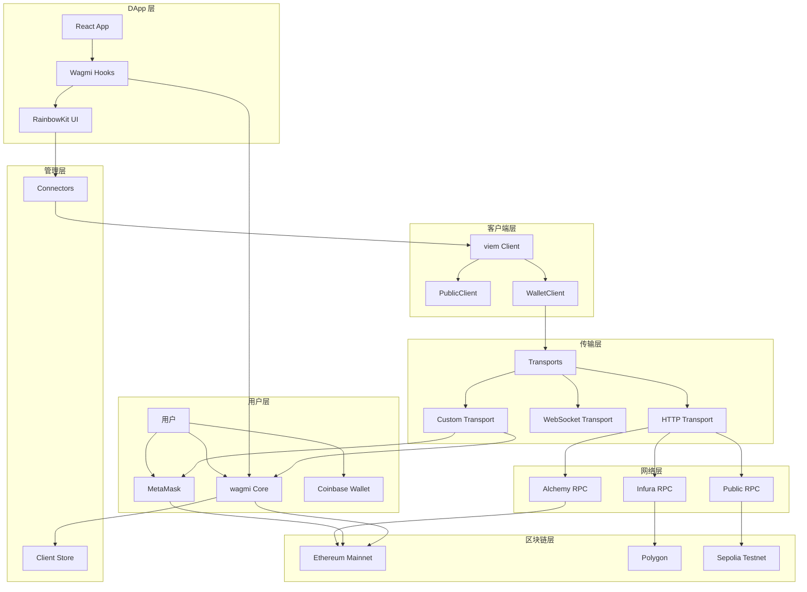
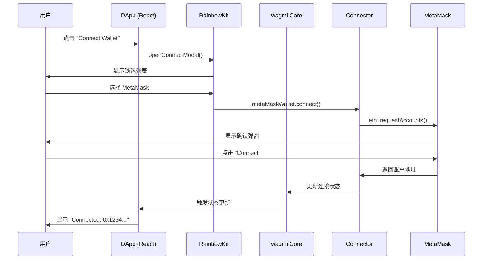
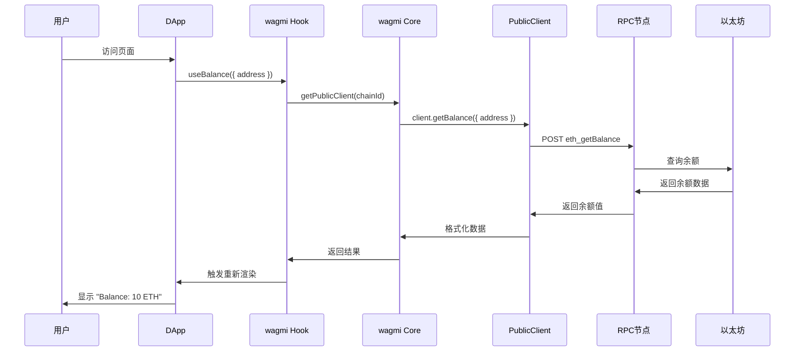
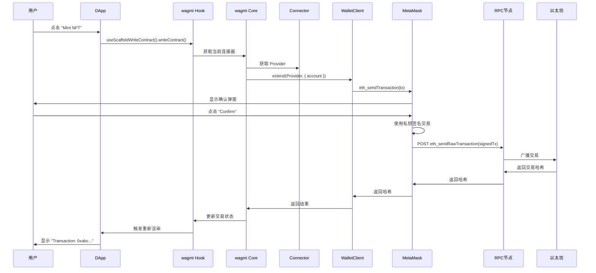
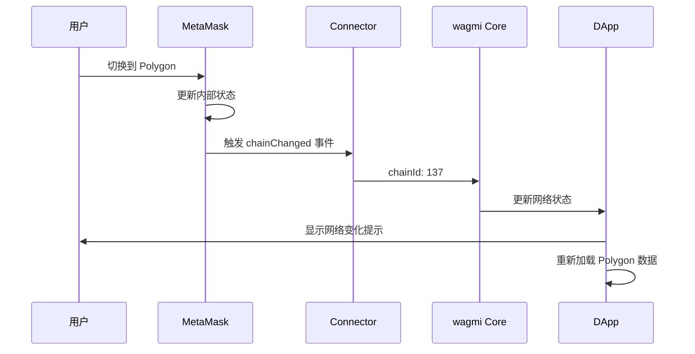

# Web3 架构完整指南：从 DApp 到区块链的交互链路

## 📖 目录

1. [整体架构概览](#整体架构概览)
2. [核心组件详解](#核心组件详解)
3. [交互流程分析](#交互流程分析)
4. [实际应用场景](#实际应用场景)
5. [架构决策与最佳实践](#架构决策与最佳实践)

---

## 🌟 整体架构概览

### 架构层次图



### 关键数据流

#### 读操作流
```
用户访问 DApp
    ↓
wagmi hooks (useBalance, useBlockNumber)
    ↓
wagmi core → PublicClient
    ↓
HTTP/WebSocket Transport → RPC 节点
    ↓
区块链数据返回
```

#### 写操作流
```
用户发起交易
    ↓
wagmi hooks (useWriteContract)
    ↓
wagmi core → WalletClient + Connector
    ↓
Connector → Wallet (MetaMask)
    ↓
用户确认 + 签名
    ↓
Wallet → RPC 节点
    ↓
区块链广播交易
```

---

## 🔧 核心组件详解

### 1. Chains (链配置)

#### 链的定义
```typescript
interface Chain {
  id: number;              // 链ID
  name: string;             // 链名称
  nativeCurrency: {         // 原生代币
    name: string;
    symbol: string;
    decimals: number;
  };
  rpcUrls: {
    default: { http: string[] };
  };
  blockExplorers?: {
    default: { url: string; name: string; };
  };
}
```

#### 你的项目中的链配置
```typescript
// viem/chains 定义
import { hardhat, mainnet, sepolia } from 'viem/chains';

// scaffold.config.ts
const scaffoldConfig = {
  targetNetworks: [chains.hardhat] // 支持的网络
};

// wagmiConfig.tsx 自动扩展
const enabledChains = targetNetworks.find(network => network.id === 1)
  ? targetNetworks
  : [...targetNetworks, mainnet]; // 自动添加主网
```

#### 链的作用
- **网络标识**：唯一标识区块链网络
- **RPC 配置**：定义网络访问端点
- **费用模型**：Gas 费用和原生代币信息
- **浏览器**：区块浏览器链接

---

### 2. Transports (传输层)

#### 传输层的职责
```typescript
// Transport = 网络通信层
interface Transport {
  request: (request: RPCRequest) => Promise<RPCResponse>;
  subscribe?: (params: SubscribeParams) => Unsubscribe;
}
```

#### 主要传输类型

##### HTTP Transport
```typescript
import { http } from 'viem';

const httpTransport = http('https://mainnet.infura.io/v3/YOUR_KEY');

// 用于：
// - 查询余额
// - 获取区块号
// - 读取合约状态
// - 一次性的 RPC 调用
```

##### WebSocket Transport
```typescript
import { websocket } from 'viem';

const wsTransport = websocket('wss://mainnet.infura.io/ws/v3/YOUR_KEY');

// 用于：
// - 实时区块监听
// - 事件订阅
// - 长连接查询
// - 新区块通知
```

##### Custom Transport
```typescript
import { custom } from 'viem';

const metaMaskTransport = custom(window.ethereum);

// 用于：
// - MetaMask 交互
// - 签名请求
// - 网络切换
// - 交易发送
```

#### 你的项目中的传输配置
```typescript
// wagmiConfig.tsx
const rpcFallbacks = [
  http(alchemyHttpUrl),    // 主要 RPC
  http()                   // 备用公共 RPC
];

const client = createClient({
  chain,
  transport: fallback(rpcFallbacks), // 自动故障转移
  pollingInterval: 30000
});
```

---

### 3. Providers (钱包提供者)

#### Provider 的本质
```typescript
// Provider = 钱包的通信接口
interface Provider {
  request(args: {
    method: string;
    params?: any[];
  }): Promise<any>;

  on?(event: string, handler: (...args: any[]) => void): void;
}
```

#### 不同类型的 Provider

##### MetaMask Provider
```typescript
const metaMaskProvider = window.ethereum;

// 特点：
// - 浏览器扩展注入
// - 支持账户管理
// - 支持交易确认
// - 支持网络切换
```

##### WalletConnect Provider
```typescript
const wcProvider = walletConnectProvider;

// 特点：
// - 移动端钱包连接
// - QR 码连接方式
// - 支持多链协议
// - 无需浏览器扩展
```

##### Custom Provider
```typescript
const customProvider = {
  request: async ({ method, params }) => {
    // 自定义 RPC 逻辑
    return fetch(rpcUrl, {
      method: 'POST',
      body: JSON.stringify({ jsonrpc: '2.0', method, params, id: 1 })
    }).then(r => r.json());
  }
};
```

---

### 4. Connectors (连接器)

#### 连接器的角色
```typescript
interface Connector {
  id: string;
  name: string;
  type: 'injection' | 'qr' | 'external' | 'hardware';

  connect(): Promise<ConnectResult>;
  disconnect(): Promise<void>;
  getAccounts(): Promise<Address[]>;
  getProvider(): Provider;

  onAccountsChanged(callback: (accounts: Address[]) => void): void;
  onChainChanged(callback: (chainId: number) => void): void;
}
```

#### RainbowKit 连接器配置
```typescript
// wagmiConnectors.tsx
const wallets = [
  metaMaskWallet,      // MetaMask 连接器
  walletConnectWallet, // WalletConnect 连接器
  coinbaseWallet,     // Coinbase 连接器
  ledgerWallet,        // 硬件钱包连接器
  rainbowWallet,       // Rainbow 钱包连接器
  safeWallet          // Gnosis Safe 连接器
];

// 连接器工厂函数
export const wagmiConnectors = () => {
  return connectorsForWallets(
    [{ groupName: "Supported Wallets", wallets }],
    { appName: "scaffold-eth-2", projectId: projectId }
  );
};
```

#### 连接器的职责
- **钱包适配**：统一不同钱包的接口
- **状态管理**：管理连接状态和事件
- **事件监听**：监听账户和网络变化
- **错误处理**：处理连接失败和错误

---

### 5. WalletClient (钱包客户端)

#### WalletClient 的能力
```typescript
const walletClient = createWalletClient({
  account: '0x...',           // 钱包地址
  chain: mainnet,             // 区块链网络
  transport: custom(provider) // 传输层
});

// 读取能力（继承自 PublicClient）
await walletClient.getBalance({ address: '0x...' });
await walletClient.getBlockNumber();
await walletClient.readContract({...});

// 写入能力
await walletClient.sendTransaction({ to: '0x...', value: parseEther('1') });
await walletClient.writeContract({...});
await walletClient.signMessage({ message: 'Hello' });
```

#### WalletClient 的两种使用模式

##### 模式1：直接控制（开发/后台）
```typescript
// Faucet.tsx
const localWalletClient = createWalletClient({
  chain: hardhat,
  transport: http('http://127.0.0.1:8545')
});

// 完全控制，无需用户确认
await localWalletClient.sendTransaction({
  to: '0x...',
  value: parseEther('100')
});
```

##### 模式2：用户控制（生产/前端）
```typescript
// 通过 wagmi hooks
const { writeContract } = useScaffoldWriteContract("MyContract");

// 用户确认后执行
await writeContract({
  functionName: "mint",
  args: [recipient]
});
```

---

### 6. Chains vs Transport 连接关系

```typescript
// 每个链可以有多个传输方式
const chainConnections = {
  mainnet: {
    chainId: 1,
    transports: [
      http('https://mainnet.infura.io/v3/key1'),  // Alchemy
      http('https://eth-mainnet.g.alchemy.com'),   // Alchemy 备用
      http('https://mainnet.infura.io/v3/key2'),  // Infura
      http('https://rpc.ankr.com/eth'),           // Ankr
      http('https://public-node.com'),            // 公共节点
    ]
  },

  polygon: {
    chainId: 137,
    transports: [
      http('https://polygon-mainnet.g.alchemy.com'), // Alchemy
      http('https://polygon-rpc.com'),               // 官方 RPC
      websocket('wss://polygon-rpc.com')           // WebSocket
    ]
  }
};

// 故障转移策略
const client = createClient({
  chain: mainnet,
  transport: fallback([
    http('https://mainnet.infura.io/v3/key1'),  // 优先级 1
    http('https://rpc.ankr.com/eth'),           // 优先级 2
    http()                                      // 优先级 3
  ])
});
```

---

## 🔄 交互流程分析

### 场景1：用户连接钱包



### 场景2：查询区块链数据（读操作）



### 场景3：发送交易（写操作）



### 场景4：网络切换



---

## 🏗️ 实际应用场景

### 1. 项目中的多网络支持

```typescript
// scaffold.config.ts - 网络配置
const scaffoldConfig = {
  targetNetworks: [
    chains.hardhat,    // 本地开发
    chains.sepolia,    // 测试网
    chains.mainnet     // 生产环境
  ]
};

// 网络颜色配置
const NETWORK_COLORS = {
  [chains.hardhat.id]: "#b8af0c",    // 黄褐色
  [chains.sepolia.id]: ["#5f4bb6", "#87ff65"], // 紫/绿双色
  [chains.mainnet.id]: "#ff8b9e"    // 粉色
};
```

### 2. RPC 故障转移机制

```typescript
// 高可用 RPC 配置
const createHighAvailabilityClient = (chain: Chain) => {
  return createClient({
    chain,
    transport: fallback([
      // 优先级1: Alchemy（快速但有限制）
      http(getAlchemyUrl(chain.id)),

      // 优先级2: Infura（稳定但贵）
      http(getInfuraUrl(chain.id)),

      // 优先级3: Ankr（免费但可能较慢）
      http(`https://rpc.ankr.com/${chain.name.toLowerCase()}`),

      // 优先级4: 公共节点（最后的保障）
      http()
    ]),
    retryCount: 3,
    retryDelay: 1000
  });
};
```

### 3. 混合钱包策略

```typescript
// 支持多种钱包连接
const walletStrategy = {
  // 桌面用户
  desktop: ['metaMask', 'coinbase', 'walletConnect'],

  // 移动用户
  mobile: ['walletConnect', 'coinbase', 'metaMask'],

  // 开发者
  developer: ['metaMask', 'hardhat'],

  // 硬件钱包用户
  hardware: ['ledger', 'trezor'],

  // 机构用户
  institution: ['gnosisSafe']
};
```

---

## 🎯 架构决策与最佳实践

### 1. 为什么使用 wagmi + RainbowKit？

```typescript
// wagmi 的优势：
const wagmiBenefits = {
  状态管理: '统一的 React 状态管理',
  类型安全: '完整的 TypeScript 支持',
  缓存优化: '智能的请求缓存',
  错误处理: '完善的错误处理机制',
  多链支持: '原生多链切换'
};

// RainbowKit 的优势：
const rainbowKitBenefits = {
  美观UI: '专业级连接界面',
  钱包集成: '支持主流钱包',
  移动适配: '响应式设计',
  主题定制: '可自定义主题',
  无障碍性: '符合 WCAG 标准'
};
```

### 2. 连接器选择策略

```typescript
// 基于用户群体的连接器配置
const selectConnectors = (userType: UserType) => {
  switch (userType) {
    case 'retail':
      return [
        metaMaskWallet,
        walletConnectWallet,
        coinbaseWallet
      ];

    case 'defi_power_user':
      return [
        metaMaskWallet,
        walletConnectWallet,
        ledgerWallet,
        trezorWallet
      ];

    case 'institution':
      return [
        gnosisSafe,
        metaMaskWallet,
        walletConnectWallet
      ];
  }
};
```

### 3. RPC 服务商策略

```typescript
// 成本和性能平衡的 RPC 配置
const rpcStrategy = {
  // 免费方案
  free: {
    primary: 'public_rpc',
    fallback: 'backup_public_rpc'
  },

  // 平衡方案（推荐）
  balanced: {
    primary: 'alchemy_free',      // 有限额度
    fallback: 'public_rpc',       // 无限额度
    timeout: 5000                 // 5秒超时
  },

  // 高性能方案
  premium: {
    primary: 'alchemy_paid',     // 高性能
    fallback: 'infura_paid',      // 高可用
    timeout: 2000,                // 2秒超时
    retries: 3                   // 重试3次
  }
};
```

### 4. 性能优化建议

```typescript
// 连接池管理
const optimizeConnectionPool = {
  // 限制同时连接数量
  maxConcurrent: 5,

  // 连接复用
  reuseConnections: true,

  // 空闲超时
  idleTimeout: 30000,

  // 健康检查
  healthCheck: {
    interval: 60000,
    endpoint: '/health'
  }
};
```

### 5. 安全最佳实践

```typescript
// 安全检查清单
const securityChecklist = {
  // 连接安全
  verifyConnection: '始终验证连接状态',
  handleDisconnection: '优雅处理断开连接',

  // 交易安全
  validateTransactions: '前端参数验证',
  userConfirmation: '重要交易需要确认',

  // 网络安全
  chainValidation: '检查链ID和网络名称',
  phishingDetection: '检测钓鱼网站',

  // 私钥安全
  neverExposeKeys: '私钥从不离开钱包',
  hardwareWallets: '大额交易使用硬件钱包'
};
```

---

## 📚 学习资源

### 官方文档
- [Wagmi 文档](https://wagmi.sh/)
- [RainbowKit 文档](https://www.rainbowkit.com/docs)
- [Viem 文档](https://viem.sh/)
- [React Hook Form 文档](https://react-hook-form.com/)

### 社区资源
- [Scaffold-ETH GitHub](https://github.com/scaffold-eth/scaffold-eth)
- [Web3 University](https://www.web3.university/)
- [CryptoZombies](https://cryptozombies.io/)

### 开发工具
- [Chainlist](https://chainlist.org/) - 网络配置
- [Etherscan](https://etherscan.io/) - 区块浏览器
- [Hardhat](https://hardhat.org/) - 开发环境

---

*这个指南涵盖了 Web3 DApp 开发的核心概念和最佳实践，帮助你构建安全、高效的区块链应用。*