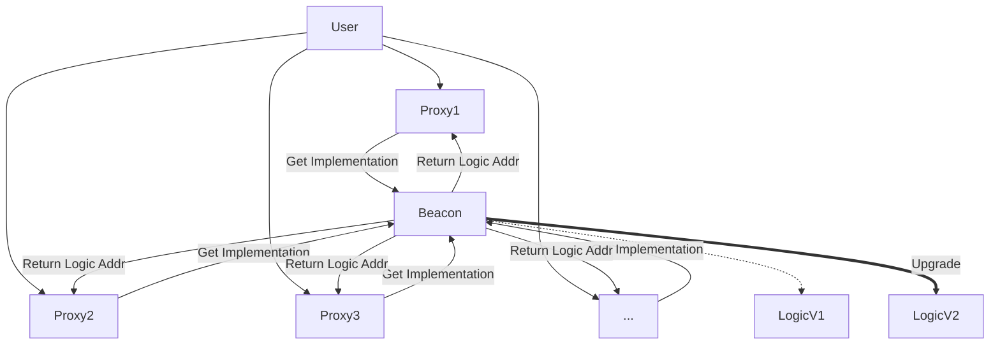

# Beacon Proxy (信标代理) 模式深度解析

Beacon Proxy 模式是代理升级的终极形态，它解决了一个特定的痛点：**当你拥有成千上万个结构相同的代理合约时，如何低成本地同时升级它们？**

## 1. 核心架构区别

### 1.1 传统模式 (Transparent / UUPS)
这是一个 **1 对 1 (One-to-One)** 的关系。
*   每个 Proxy 都在自己的 Storage 里存储了 Implementation 地址。
*   **升级**: 如果你有 10,000 个 Proxy，你需要发送 10,000 笔交易，分别去更新它们各自的存储槽。
*   **成本**: 极高，几乎不可行。

### 1.2 Beacon 模式
这是一个 **1 对 多 (One-to-Many)** 的关系。引入了一个中间层——**Beacon (信标)** 合约。
*   **Proxy**: 不存 Implementation 地址，只存 **Beacon 地址**。
*   **Beacon**: 存储 **Implementation 地址**。
*   **升级**: 只需要给 **Beacon** 发送 **1 笔** 交易，把 Beacon 里的 Logic 地址换掉。
*   **结果**: 所有 10,000 个指向该 Beacon 的 Proxy，在下一次调用时，去问 Beacon 要地址，都会立刻得到新的地址。**瞬间全部升级**。

## 2. 技术原理实现

### 2.1 BeaconProxy.sol (代理端)
这是用户部署的合约（那个成千上万的副本）。
*   **存储**: 这一回，它不存逻辑合约地址了。它存的是 **Beacon 的地址**（通常存在一个特定的 EIP-1967 Beacon Slot `0xa3f0...` 里）。
*   **执行逻辑**:
    1.  收到调用。
    2.  读取 Beacon 地址。
    3.  调用 `IBeacon(beaconAddress).implementation()`。（注意：这是 `staticcall`，不是 `delegatecall`）。
    4.  拿到返回的 Logic 地址。
    5.  `delegatecall` 到这个 Logic 地址。

### 2.2 UpgradeableBeacon.sol (信标端)
这是管理员控制的核心合约。
*   **存储**: 存储真正的 Logic 地址。
*   **功能**:
    *   `implementation()`: 返回当前的 Logic 地址（供 Proxy 查询）。
    *   `upgradeTo(newImplementation)`: 修改 Logic 地址（仅限 Owner）。

### 2.3 逻辑合约 (Implementation)
跟普通的 UUPS/Transparent 逻辑合约完全一样。
*   **区别**: 不需要写升级函数！因为升级是在 Beacon 上发生的，跟 Logic 自身无关。

## 3. 优缺点分析

| 特性 | Beacon Proxy | UUPS Proxy | Transparent Proxy |
| :--- | :--- | :--- | :--- |
| **升级效率** | 👑 **O(1)** (一键全升) | O(N) (一个个升) | O(N) (一个个升) |
| **Gas 消耗 (运行)** | 高 (多一次外部调用去问 Beacon) | 低 | 中 |
| **部署成本** | 低 (BeaconProxy 很小) | 极低 | 高 |
| **适用场景** | 批量生成合约 (工厂模式) | 独立大合约 (单例) | 旧系统 |

## 4. 实际使用案例

### 4.1 交易所/钱包服务商 (如 Argent, Dharma)
*   **场景**: 每个用户注册时，平台都会给用户部署一个独立的“智能钱包合约”。
*   **数量**: 可能有 100 万个用户 = 100 万个合约。
*   **需求**: 发现了一个漏洞，需要紧急修复所有用户的钱包。
*   **方案**: 使用 Beacon 模式。平台 owner 只需要升级 Beacon，所有 100 万用户的钱包瞬间修复。

### 4.2 游戏道具/NFT
*   某些复杂的 NFT 项目，每个 Token 实际上是一个独立的合约（bound account），或者某种复杂的 DeFi 仓位合约。
*   当游戏规则改变时，需要所有道具合约同时更新逻辑。

### 4.3 为什么选择它？
**这是唯一的选择**。对于这种大规模实例场景，UUPS 和 Transparent 的升级成本是天文数字，根本无法维护。

## 5. 总结

Beacon Proxy 是**工厂模式 (Factory Pattern)** 的最佳搭档。
如果你需要通过 Factory `create` 很多很多个功能一样的合约，并且希望保留未来升级它们的权利，那么 **BeaconProxy** 是不二之选。
