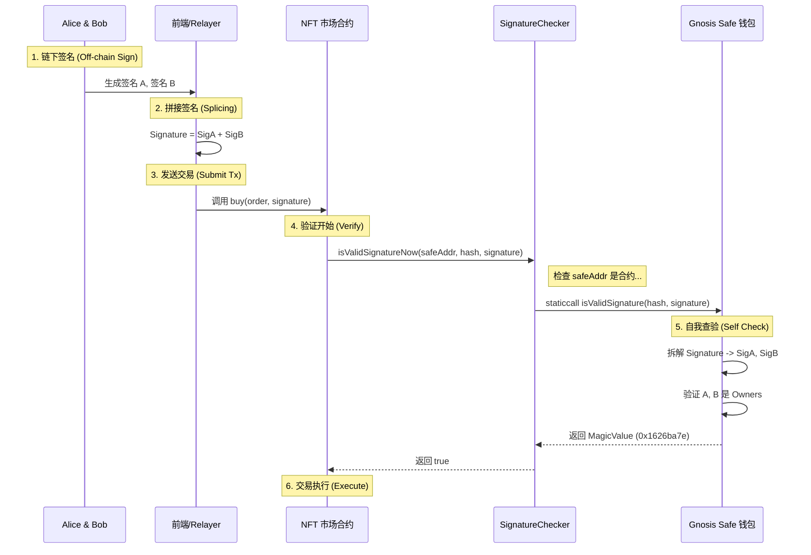

# OpenZeppelin SignatureChecker 深度解析

**文件路径**: [packages/hardhat/node_modules/@openzeppelin/contracts/utils/cryptography/SignatureChecker.sol](file:///Users/snome/defi/stake-projetc/nft-stake-ponder/packages/hardhat/node_modules/@openzeppelin/contracts/utils/cryptography/SignatureChecker.sol)

## 1. 这个文件是做什么的？

`SignatureChecker` 是一个辅助库 (Library)，旨在解决 Web3 开发中的一个经典难题：**如何统一验证普通账户 (EOA) 和智能合约钱包 (Contract Wallet) 的签名？**

在以太坊中，有两种账户：
1.  **EOA (外部拥有账户)**: 如 MetaMask 生成的地址。使用私钥通过 `ECDSA` 算法签名。
2.  **智能合约钱包**: 如 Gnosis Safe, Argent。它们没有私钥，无法进行 ECDSA 签名。它们使用 **EIP-1271** 标准来验证签名。

`SignatureChecker` 封装了这两种验证逻辑，提供了一个统一的接口 `isValidSignatureNow`。你不需要关心对方是人还是合约，调用它就行。

## 2. 源码逐行解读

### 引用
```solidity
import {ECDSA} from "./ECDSA.sol";
import {IERC1271} from "../../interfaces/IERC1271.sol";
```
引入了 `ECDSA` 库用于恢复 EOA 签名，引入 `IERC1271` 接口用于调用合约钱包的验证函数。

### 核心函数: `isValidSignatureNow`
```solidity
function isValidSignatureNow(address signer, bytes32 hash, bytes memory signature) internal view returns (bool) {
    (address recovered, ECDSA.RecoverError error, ) = ECDSA.tryRecover(hash, signature);
    return
        (error == ECDSA.RecoverError.NoError && recovered == signer) ||
        isValidERC1271SignatureNow(signer, hash, signature);
}
```
**逻辑流程**:
1.  **尝试 ECDSA 恢复**: 假设 `signer` 是个 EOA，尝试从 `signature` 和 `hash` 中恢复出公钥地址。
2.  **判断 EOA**: 如果恢复成功且 `recovered` 地址等于传入的 `signer`，验证通过（说明是本人签的）。
3.  **兜底合约验证**: 如果 ECDSA 验证失败（比如 `signer` 是个合约地址，它不仅没有私钥，且 ECDSA 恢复出的地址肯定不等于它自己），则调用 `isValidERC1271SignatureNow` 走合约验证流程。

### 合约验证函数: `isValidERC1271SignatureNow`
```solidity
function isValidERC1271SignatureNow(
    address signer,
    bytes32 hash,
    bytes memory signature
) internal view returns (bool) {
    (bool success, bytes memory result) = signer.staticcall(
        abi.encodeCall(IERC1271.isValidSignature, (hash, signature))
    );
    return (success &&
        result.length >= 32 &&
        abi.decode(result, (bytes32)) == bytes32(IERC1271.isValidSignature.selector));
}
```
**关键点**:
1.  **Staticcall**: 使用 `staticcall` 调用 `signer` 地址的 `isValidSignature(hash, signature)` 函数。这是 EIP-1271 定义的标准接口。
2.  **返回值检查**: EIP-1271 规定，如果签名有效，合约必须返回魔术值 `0x1626ba7e` (即 `isValidSignature` 的 function selector)。
3.  **安全性**: 检查 `success` 且返回值匹配，才算验证通过。

## 3. 交互流程图解 (Who checks whom?)

你的理解完全正确。验证的动作是**目标合约**发起的。

**场景**: Gnosis Safe 用户 Alice & Bob 想要在 NFT 市场 (Target) 挂单。



**关键点**:
*   **检查者 (Verifier)**: 是 **Target (NFT 市场)**。它不想关心 `safeAddr` 到底是什么，它只管调用 `SignatureChecker`。
*   **被查者 (Signer)**: 是 **Safe 钱包**。它提供了 `isValidSignature` 接口供人查询。
*   **传递物 (Proof)**: 就是那串拼接的 `signature`。它像是一个“通关令牌”，由 Target 递给 Safe，Safe 检查令牌里的内容（Alice 和 Bob 的手印）是否属实。

## 4. 使用场景 (Use Cases)


任何需要**"验证用户意图"**且**"不希望只局限于 EOA 用户"**的场景：

1.  **NFT 交易市场 (Order Book)**:
    *   用户（无论是 EOA 还是 Gnosis Safe 多签钱包）签名一个订单 "我愿意以 1 ETH 卖出 NFT #123"。
    *   市场合约在撮合时，使用 `SignatureChecker` 验证签名的有效性。

2.  **Meta Transactions (元交易/无 Gas 交易)**:
    *   用户签名一个交易意图，由 Relayer 代为上链。
    *   目标合约验证签名确认是用户本人的意图。

3.  **Token Permit (EIP-2612 的扩展)**:
    *   虽然标准 EIP-2612 仅支持 ECDSA，但在新版设计中，越来越多的 Permit 实现开始兼容 EIP-1271，以便多签钱包也能离线授权。

4.  **身份认证 (Login)**:
    *   Web2 网站验证 Web3 身份时，如果用户用的是 Gnosis Safe，必须用 EIP-1271 验证（后端逻辑同理）。

## 5. 核心解惑：多签钱包的两种交互模式

你之所以感到困惑，是因为多签钱包确实有两种截然不同的使用方式。**`SignatureChecker` 用于第二种方式**。

### 模式 A：作为交易发起者 (Direct Execution)
这是你"固有理解"中的经典模式。
*   **场景**: 多签钱包要转账 100 ETH 给别人，或者调用 Uniswap 去 Swap。
*   **流程**:
    1.  Alice 和 Bob 在链下签名。
    2.  任何人（通常是其中一个 Owner）向**多签合约**发送交易 `execTransaction(..., signatures)`。
    3.  **多签合约**验证签名通过后，以**自身的名义** (`msg.sender` = Safe) 去调用目标合约。
*   **特点**: 目标合约看到的 `msg.sender` 就是多签钱包。目标合约不需要知道这是多签，它只以此识别身份。**这里不需要 EIP-1271**。

### 模式 B：作为签名者 (Signer / EIP-1271)
这是 `SignatureChecker` 解决的场景，也是我们在图中画的。
*   **场景**: 链下挂单 (OpenSea)、元交易 (Permit)、登录验证。
*   **痛点**: 在这些场景中，**没有发生这笔 Transaction**。Alice 只是想证明 "我同意这个订单"，但不想花 Gas 去链上执行它。她想让这个订单挂在系统里，等待别人来匹配。
*   **流程**:
    1.  Alice 和 Bob 链下签名了一个**文本/数据**（比如 "卖出 NFT #1"）。
    2.  这个签名被前端或者 Relayer 收集起来，附带在订单里。
    3.  当**撮合发生时**（比如买家来买了），买家带着这个签名去调用 NFT 市场。
    4.  NFT 市场需要验证：*"挂单的这个多签钱包，真的同意卖吗？"* -> **调用 EIP-1271 验证**。
*   **特点**: 多签钱包在这里是被动的，它没有发起交易，它只是被询问。

**总结**:
*   如果你要多签钱包**动**（转账、操作），用模式 A。
*   如果你要多签钱包**说话**（表态、授权、挂单），用模式 B (EIP-1271)。
